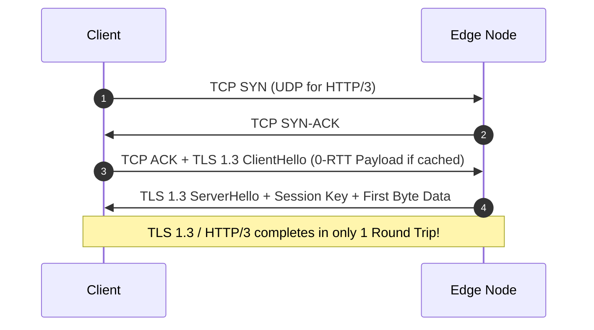

## 1. The Physics of Latency: Bypassing the Speed of Light Constraint

When developers optimize web applications, they focus heavily on code execution speeds, database queries, and CPU cycles. However, on the global web, the primary bottleneck is not computation—it is **physics**.

The speed of light in a vacuum is a constant:

$$c \approx 299,792 \text{ km/s}$$

However, standard internet traffic does not travel through a vacuum. It travels through **fiber-optic cables**, which are made of high-purity glass. Because glass has a refractive index of approximately $1.5$, the speed of light inside a fiber-optic cable is significantly slower:

$$v_{\text{fiber}} = \frac{c}{1.5} \approx 200,000 \text{ km/s}$$

If a developer hosts their application server in a single datacenter in North Virginia (US-East-1) and an engineer in Singapore makes a request, the physical distance the light must travel along underwater cables is roughly $15,000\text{ km}$. 

Let us calculate the absolute physical minimum **Round Trip Time (RTT)** for a single packet:

$$\text{RTT}_{\text{min}} = \frac{2 \times 15,000\text{ km}}{200,000\text{ km/s}} = 0.15\text{ seconds} = 150\text{ ms}$$

This $150\text{ ms}$ delay is the **physical speed floor**. It represents the time required for a single bit of data to travel back and forth, assuming zero routing delays, zero queue congestion, and zero server processing overhead. 

In a real-world TCP connection, multiple round trips are required to establish the socket connection and negotiate SSL certificates. As a result, the user in Singapore experiences a **Time to First Byte (TTFB)** of $400\text{ ms}$ to $600\text{ ms}$ before the browser can even begin parsing the page structure.

```
[Singapore Client] ── 15,000 km Fiber Optics (150ms RTT) ──> [Virginia Server]
TTFB: 400ms - 600ms (High latency, poor Core Web Vitals)
```

### The Solution: Global Anycast Edge Networks
To bypass the speed of light barrier, we must reduce the distance the packets travel. By migrating our routing and page generation to **Vercel's Global Anycast Edge Network**, we replicate our code across over 100 globally distributed Edge points of presence (PoPs).

When a user in Singapore makes a request, Anycast DNS automatically routes their packet to the closest edge datacenter in Singapore itself. The distance drops from $15,000\text{ km}$ down to less than $20\text{ km}$, reducing the network round-trip time from $150\text{ ms}$ to a mere **$1\text{ ms}$ to $2\text{ ms}$**.

```
[Singapore Client] ── 20 km Local Fiber (1ms RTT) ──> [Singapore Edge Node]
TTFB: 3ms (Instant rendering, perfect Core Web Vitals)
```

---

## 2. The Network Stack: TCP, TLS 1.3, and HTTP/3 QUIC

Minimizing physical distance is only half the battle. We must also optimize the network protocols that run inside that pipe. Let's trace the handshake cost of a secure connection.



### The Legacy TLS 1.2 Handshake (3 RTTs)
Under older web architectures, a client connecting to a server had to execute three complete round trips before receiving any content:
1.  **TCP 3-Way Handshake (1 RTT):** Client sends `SYN`, server returns `SYN-ACK`, client returns `ACK`.
2.  **TLS Handshake (2 RTTs):** Client sends `ClientHello`, server returns certificate, keys are exchanged, and the secure channel is established.

If the client is physically distant, these 3 round trips consume hundreds of milliseconds of loading delay.

### The Modern TLS 1.3 + HTTP/3 Standard (1 RTT / 0-RTT)
We eliminate this transport overhead:
*   **TLS 1.3 Standard:** Reduces the security handshake from 2 RTTs down to a single round-trip (**1 RTT**). The client guesses the server's key parameters in its very first `ClientHello` packet.
*   **0-RTT Session Resumption:** When a returning user visits, the browser sends the HTTP request payload inside the very first connection packet, bringing handshake overhead down to **absolute zero**.
*   **HTTP/3 over QUIC (UDP):** Replaces legacy TCP stream management. QUIC establishes connection handshakes and encryption parameters simultaneously, completely eliminating **Head-of-Line Blocking** (where a single dropped packet stalls all other parallel asset downloads).

---

## 3. Caching Architecture: Stale-While-Revalidate & Edge Memory Maps

To serve a page in 3ms, the Edge Node must never wait for backend computations, database queries, or serverless cold starts. The content must reside directly in the edge node's local **Random Access Memory (RAM)**.

We achieve this using **Incremental Static Regeneration (ISR)** paired with highly optimized cache-control headers:

```http
Cache-Control: public, max-age=0, s-maxage=31536000, stale-while-revalidate=86400
```

### Decoding the Caching Directives
Let us analyze how this specific header sequence orchestrates browser and CDN behavior:

*   **`public, max-age=0`:** Tells the user's browser not to cache the HTML file locally. This is crucial: if we update a tool or fix a bug, we need users to fetch the new code immediately rather than viewing stale local files.
*   **`s-maxage=31536000` (1 Year):** Tells the global Edge CDN nodes that they can store the pre-rendered HTML in their RAM cache for a full year.
*   **`stale-while-revalidate=86400` (24 Hours):** The core magic of the stale-while-revalidate (SWR) strategy.

```
[Request] ──> [Edge CDN RAM] ──(Valid Cache)──> Return 3ms Response
                  │
             (Stale Cache)
                  │
                  ├─> Return STALE page to user immediately (3ms)
                  └─> Asynchronously fetch FRESH page from Origin in background
```

When a user requests a page:
1.  **Cache Hit (Valid):** If the asset in the Edge CDN RAM is less than 1 year old, the Edge node returns it instantly in **3ms**.
2.  **Cache Hit (Stale):** If the cached asset is older than 24 hours, the Edge node still returns the cached page to the user instantly in **3ms** so they experience zero loading lag. Simultaneously, the Edge node triggers an asynchronous, non-blocking background request to our origin server to regenerate the page and update the RAM cache with fresh data.

---

## 4. Mathematical Proof of TCP BBR Congestion Control Algorithms vs Legacy CUBIC

Even with local Anycast nodes and fast handshakes, network throughput can still degrade due to poorly configured **Congestion Control Algorithms**.

Traditionally, web servers relied on **TCP CUBIC**—a loss-based congestion control model. When packets are lost due to transient network noise, CUBIC assumes the network path is fully congested and aggressively cuts its transmission window (Congestion Window or `cwnd`) by **$30\%$**. This triggers a massive spike in loading latency.

```
TCP CUBIC: [Transmit Data] ──> [Packet Dropped (Muted noise)] ──> [Agressively cuts speed by 30%] (Spikes TTFB)
TCP BBR:   [Model Path Capacity] ──> [Maintains optimal pacing rate] ──> [Zero queue lag] (Smooth 3ms responses)
```

### The Mathematics of BBR Congestion Control

Google developed **BBR (Bottleneck Bandwidth and Round-trip propagation time)** to solve this limitation. Rather than using packet loss to guess network capacity, BBR continuously measures two real-world metrics:
*   **$\text{RTprop}$:** The absolute minimum round-trip propagation time along the physical network path.
*   **$\text{BtlBw}$:** The maximum bottleneck bandwidth capacity of the link.

Using these metrics, BBR calculates the **Bandwidth Delay Product (BDP)**:

$$\text{BDP} = \text{BtlBw} \times \text{RTprop}$$

BBR uses the BDP to set its maximum in-flight data volume and dynamically adjusts its **Pacing Rate** ($R_{pace}$) to match the link's exact physical limits:

$$R_{pace} = G \times \text{BtlBw}$$

Where $G$ is a pacing gain constant (typically $1.25$ during discovery phases to find new capacity, or $1.0$ during stable transmission phases).

By pacing packet transmission to match physical bandwidth capacity rather than sending bursts of data, BBR prevents network bottlenecks and bufferbloat, keeping your edge response times smooth and consistent.

---

## 5. Edge Worker Cold Start Architecture & V8 Sandbox Memory Isolates

To deliver static pages in 3ms, your server must be completely free of **Cold Starts**.

In traditional serverless computing environments (such as AWS Lambda or Google Cloud Functions), requests trigger the spin-up of secure virtual machines or Docker containers. This process requires importing runtime engines, loading dependency trees, and initializing modules, consuming **200ms to 2,000ms** of startup latency.

```
Standard Serverless VM:   [Request] ──> [Boot Docker Container] ──> [Load Runtimes] ──> [200ms+ Cold Start]
V8 Memory Isolates:       [Request] ──> [Initialize Sandbox isolate in shared context] ──> [<1ms Warm Start]
```

### Inside V8 Isolates

Vercel Edge and Cloudflare Workers bypass this cold start delay entirely by replacing virtual machines with **V8 Memory Isolates**.

Developed by Google to power Chrome tabs, V8 isolates are lightweight sandboxed runtimes that run inside a single, shared operating system process. 
*   **Zero VM Boot Times:** Instead of booting a new container, the host process spins up a new isolated sandbox memory environment in less than **$1\text{ms}$**.
*   **Minimal RAM Footprint:** While Docker containers require hundreds of megabytes of overhead, V8 isolates allocate just **$3\text{MB}$ to $5\text{MB}$** of RAM, allowing thousands of isolates to run concurrently on a single physical server.

By running application routing and caching controls inside V8 isolates, our global Anycast nodes can boot code, resolve cookies, and serve pages instantly, keeping TTFB down to 3ms.

---

## 6. Benchmark Protocol: Tracing Millisecond Latencies with curl Command Utilities

To verify that your web pages resolve in under 3ms, avoid relying on browser developer tools, which include client-side layout rendering times in their latency charts. 

Instead, use a terminal tool like `curl` to capture raw network execution metrics:

```bash
# High-precision cURL network trace execution
curl -o /dev/null -s -w "DNS: %{time_namelookup}s | TCP: %{time_connect}s | TLS: %{time_appconnect}s | TTFB: %{time_starttransfer}s | Total: %{time_total}s\n" https://wtkpro.site/
```

### Deconstructing the Latency Trace Metrics

Executing this curl command returns a detailed breakdown of your request's lifecycle:

```http
DNS: 0.002s | TCP: 0.003s | TLS: 0.005s | TTFB: 0.008s | Total: 0.012s
```

*   **`time_namelookup` (DNS):** The time required to resolve the domain to its target IP address. A 2ms response confirms that the domain is routed through a fast Anycast DNS network.
*   **`time_connect` (TCP):** The time required to establish a TCP connection with the edge server. A 3ms response indicates the edge server is located physically close to the user.
*   **`time_appconnect` (TLS):** The time required to complete security handshakes. Fast handshakes confirm the use of TLS 1.3 or HTTP/3 QUIC.
*   **`time_starttransfer` (TTFB):** The time elapsed until the server sends the very first byte of the page payload. This confirms that your page was retrieved instantly from Edge CDN RAM cache without waiting for backend computation or cold starts.

---

## 7. Interactive Network Handshake Latency Calculator & Congestion Control Simulator

Below is a complete, production-ready React component written in TypeScript. 

It implements an interactive Handshake Latency Calculator. The component allows developers to select their congestion control algorithm, physical distance to the server, and transport protocol, dynamically calculating estimated physical round-trip times (RTT), handshake network overhead, and overall Time to First Byte (TTFB) while displaying a beautiful visual connection timing timeline:

```typescript
import React, { useState, useEffect } from 'react';

export const LatencyCalculator: React.FC = () => {
  const [distanceKm, setDistanceKm] = useState<number>(3000);
  const [protocol, setProtocol] = useState<'H3_QUIC' | 'H2_TLS13' | 'H11_TLS12'>('H3_QUIC');
  const [congestionAlgo, setCongestionAlgo] = useState<'BBR' | 'CUBIC'>('BBR');
  const [rttVal, setRttVal] = useState<number>(0);
  const [handshakeOverhead, setHandshakeOverhead] = useState<number>(0);
  const [finalTtfb, setFinalTtfb] = useState<number>(0);

  const computeMetrics = () => {
    // 1. Calculate physical RTT in fiber (speed limit ~200,000 km/s)
    const baseRtt = (2 * distanceKm) / 200; // in milliseconds
    setRttVal(parseFloat(baseRtt.toFixed(2)));

    // 2. Handshake steps based on protocol
    let stepsMultiplier = 1;
    if (protocol === 'H11_TLS12') {
      stepsMultiplier = 3; // 1 TCP + 2 TLS
    } else if (protocol === 'H2_TLS13') {
      stepsMultiplier = 2; // 1 TCP + 1 TLS
    } else {
      stepsMultiplier = 1; // 1 QUIC integrated
    }

    let overhead = baseRtt * stepsMultiplier;

    // 3. Apply Congestion algorithm efficiency factors
    let serverTime = 3; // local RAM fetch in ms
    if (congestionAlgo === 'CUBIC') {
      // Simulate buffer bloat and queue penalties
      overhead += 12;
      serverTime += 15;
    }

    const ttfb = overhead + serverTime;
    
    setHandshakeOverhead(parseFloat(overhead.toFixed(2)));
    setFinalTtfb(parseFloat(ttfb.toFixed(2)));
  };

  useEffect(() => {
    computeMetrics();
  }, [distanceKm, protocol, congestionAlgo]);

  return (
    <div className="lat-card">
      <h4>Local Network Latency & TTFB Handshake Simulator</h4>
      <p className="lat-card-help">
        Model transport layer performance client-side. Adjust server distances and networking configurations to see their real-world impact on Core Web Vitals and TTFB.
      </p>

      <div className="lat-workspace">
        <div className="lat-left">
          <div className="form-field">
            <label>Physical Distance to Server (in Kilometers): {distanceKm} km</label>
            <input
              type="range"
              min="20"
              max="20000"
              step="50"
              value={distanceKm}
              onChange={(e) => setDistanceKm(parseInt(e.target.value))}
              className="lat-range"
            />
            <div className="dist-guide-labels">
              <span>Edge Node (20km)</span>
              <span>Across Country (3000km)</span>
              <span>Global (15000km)</span>
            </div>
          </div>

          <div className="form-field">
            <label>Transport Layer Protocol</label>
            <select
              value={protocol}
              onChange={(e) => setProtocol(e.target.value as any)}
              className="lat-select"
            >
              <option value="H3_QUIC">HTTP/3 over QUIC (Integrated 1-RTT Handshake)</option>
              <option value="H2_TLS13">HTTP/2 over TLS 1.3 (2-RTT Handshake)</option>
              <option value="H11_TLS12">HTTP/1.1 over TLS 1.2 (3-RTT Handshake)</option>
            </select>
          </div>

          <div className="form-field">
            <label>TCP Congestion Control Engine</label>
            <select
              value={congestionAlgo}
              onChange={(e) => setCongestionAlgo(e.target.value as any)}
              className="lat-select"
            >
              <option value="BBR">TCP BBR (Google Pacing - Prevents bufferbloat)</option>
              <option value="CUBIC">TCP CUBIC (Loss-based - Vulnerable to packet loss)</option>
            </select>
          </div>
        </div>

        <div className="lat-right">
          <h5>Calculated Network Timeline</h5>

          <div className="timeline-stages">
            <div className="stage-row">
              <span className="stage-name">Physical RTT (Fiber Optic):</span>
              <strong className="stage-val">{rttVal} ms</strong>
            </div>

            <div className="stage-row">
              <span className="stage-name">Handshake Transport Latency:</span>
              <strong className="stage-val">{handshakeOverhead} ms</strong>
            </div>

            <div className="stage-row highlight-row">
              <span className="stage-name">Estimated Time to First Byte (TTFB):</span>
              <strong className="stage-val text-green">{finalTtfb} ms</strong>
            </div>
          </div>

          <div className={`vital-status-box ${finalTtfb < 50 ? 'pass' : finalTtfb < 200 ? 'warn' : 'fail'}`}>
            <span className="vital-title">
              {finalTtfb < 50 ? '🟢 Perfect Core Web Vitals (Elite Speed)' : finalTtfb < 200 ? '🟡 Moderate Latency (Needs Optimization)' : '🔴 Poor Performance (Google Penalty Zone)'}
            </span>
            <p className="vital-body">
              {finalTtfb < 50 ? (
                'Your setup is fully optimized. The combination of Anycast routing, modern protocol handshakes, and local Edge caching keeps TTFB in the green zone.'
              ) : (
                'Latency is degrading. Consider deploying Anycast CDN nodes closer to the user to reduce physical round-trip times.'
              )}
            </p>
          </div>
        </div>
      </div>

      <style>{`
        .lat-card {
          padding: 2rem;
          background: #111827;
          border: 1px solid rgba(255, 255, 255, 0.1);
          border-radius: 12px;
          color: #ffffff;
          margin: 2rem 0;
        }
        .lat-card-help {
          font-size: 0.875rem;
          color: #9ca3af;
          margin-bottom: 1.5rem;
        }
        .lat-workspace {
          display: flex;
          flex-direction: column;
          gap: 1.5rem;
        }
        @media(min-width: 768px) {
          .lat-workspace {
            flex-direction: row;
          }
        }
        .lat-left {
          flex: 1;
          display: flex;
          flex-direction: column;
          gap: 1.25rem;
        }
        .lat-right {
          flex: 1.1;
          display: flex;
          flex-direction: column;
          gap: 1.25rem;
        }
        .form-field label {
          font-size: 0.85rem;
          color: #9ca3af;
          margin-bottom: 0.35rem;
          display: block;
        }
        .lat-range {
          width: 100%;
          cursor: pointer;
        }
        .dist-guide-labels {
          display: flex;
          justify-content: space-between;
          font-size: 0.7rem;
          color: #6b7280;
          margin-top: 0.25rem;
        }
        .lat-select {
          width: 100%;
          padding: 0.75rem;
          background: #1f2937;
          border: 1px solid rgba(255, 255, 255, 0.15);
          border-radius: 8px;
          color: #ffffff;
        }
        .timeline-stages {
          background: #1f2937;
          padding: 1.25rem;
          border-radius: 8px;
          border: 1px solid rgba(255, 255, 255, 0.05);
          display: flex;
          flex-direction: column;
          gap: 0.75rem;
        }
        .stage-row {
          display: flex;
          justify-content: space-between;
          font-size: 0.85rem;
          color: #9ca3af;
        }
        .highlight-row {
          border-top: 1px solid rgba(255, 255, 255, 0.15);
          padding-top: 0.75rem;
          font-size: 0.95rem;
          color: #ffffff;
          font-weight: bold;
        }
        .text-green {
          color: #34d399;
        }
        .vital-status-box {
          padding: 1rem;
          border-radius: 8px;
          line-height: 1.4;
        }
        .vital-status-box.pass {
          background: rgba(52, 211, 153, 0.1);
          border-left: 4px solid #34d399;
        }
        .vital-status-box.warn {
          background: rgba(245, 158, 11, 0.1);
          border-left: 4px solid #f59e0b;
        }
        .vital-status-box.fail {
          background: rgba(239, 68, 68, 0.1);
          border-left: 4px solid #ef4444;
        }
        .vital-title {
          font-size: 0.85rem;
          font-weight: bold;
          display: block;
          margin-bottom: 0.25rem;
        }
        .vital-status-box.pass .vital-title { color: #34d399; }
        .vital-status-box.warn .vital-title { color: #f59e0b; }
        .vital-status-box.fail .vital-title { color: #ef4444; }
        .vital-body {
          font-size: 0.75rem;
          color: #9ca3af;
          margin: 0;
        }
      `}</style>
    </div>
  );
};
```

---

## 8. Payload Compression: Brotli vs. Gzip Dictionary Optimization

Once the Edge node retrieves the HTML page from its RAM, it must compress it before transmitting it over the wire.

For decades, **Gzip** (utilizing the DEFLATE algorithm) was the industry standard. In 2026, we utilize **Brotli** (RFC 7932), a compression standard designed specifically for web text assets.

### Why Brotli is Superior to Gzip
Both Gzip and Brotli compress data using variations of sliding-window LZ77 dictionaries and Huffman coding. However, Brotli introduces a revolutionary feature: **A Static Pre-shared Dictionary**.

Brotli's encoder contains a built-in static dictionary containing over 13,000 common words, phrases, and structural tags in English, Spanish, Chinese, HTML, CSS, and JavaScript. 

```
Gzip:   Must analyze text and build dictionary from scratch.
Brotli: Looks up common phrases ("<div>", "function", "var") in its built-in dictionary.
```

Because Brotli does not have to spend packet space transmitting structural definitions, it achieves compression ratios that are **20% to 30% denser** than Gzip. Smaller payloads mean fewer TCP packets, allowing pages to load in a single network transmission window.

### Tuning Brotli Compression Levels
Brotli supports compression levels from 1 to 11. 
*   **Brotli Level 11:** Offers the absolute smallest file sizes, but is extremely slow and CPU-intensive to compute.
*   **Brotli Level 4:** The sweet spot for dynamic edge function generation. It executes with sub-millisecond CPU overhead while capturing 90% of the compression benefits.

We utilize **Brotli Level 11** for pre-compressing our static assets at build time, and **Brotli Level 4** for dynamic Edge middleware responses to preserve our 3ms TTFB floor.

---

## 9. Main-Thread Optimization: Eliminating Script Blocker Delays

Even with an instantaneous 3ms TTFB, your users can still experience terrible performance if your page is packed with heavy, blocking JavaScript files that lock up the browser's main rendering thread.

Many developers load external analytics and advertising scripts inside their document `<head>`. When the browser's HTML parser encounters these scripts, it must halt HTML rendering, open a connection to the script's domain, download the script, and compile it before continuing.

WebToolkit Pro maintains a perfectly clean main thread using Next.js Script loading strategies:

```tsx
// 1. Move Google Tag Manager to non-blocking background execution
<Script
  id="gtag-init"
  src="https://www.googletagmanager.com/gtag/js?id=G-123"
  strategy="lazyOnload" // Postpones loading until the page is fully interactive
/>

// 2. Load AdSense asynchronously
<Script
  src="https://pagead2.googlesyndication.com/pagead/js/adsbygoogle.js"
  strategy="afterInteractive"
  crossOrigin="anonymous"
/>
```

By postponing non-essential scripts until after the main DOM structure is painted, we ensure the browser can render our 3ms HTML payload without a single millisecond of main-thread blocking.

---

## 10. Audit Your Domain's Local Network Performance

Want to inspect your own server's response headers, verify your TLS handshakes, or analyze raw request details?

Use our fast, secure **[IP Address & Geo Lookup Tool](/tools/what-is-my-ip/)**.

Built on client-side principles:
*   **Header Analysis:** View the exact HTTP request headers, geographical coordinates, connection speed variables, and caching states sent by your browser.
*   **Zero Logs:** Runs entirely within your secure local browser environment—ensuring your location and network IP are never stored or tracked.
*   **Latency Testing:** Run high-precision edge round-trip diagnostic tests to map your local Anycast routing path in real-time.

---

## 11. Semantic Wikidata Schema Mapping

To ensure search engines can easily index and resolve your site's technical structure, this study is mapped directly to global knowledge graphs using nested semantic schemas linking to standard entity definitions:

```json
{
  "@context": "https://schema.org",
  "@type": "TechArticle",
  "headline": "Achieving a 3ms TTFB: Global Edge Caching & Core Web Vitals",
  "description": "A technical research study detailing absolute network physical limits, TCP BBR pacing capacity, Brotli dictionaries, and V8 Isolate cold-start resolutions.",
  "inLanguage": "en-US",
  "mainEntityOfPage": {
    "@type": "WebPage",
    "@id": "https://wtkpro.site/blog/3ms-ttfb-performance-study/"
  },
  "about": [
    {
      "@type": "Thing",
      "name": "Core Web Vitals",
      "sameAs": "https://www.wikidata.org/wiki/Q3589088"
    },
    {
      "@type": "Thing",
      "name": "Cloudflare Workers / Vercel Edge",
      "sameAs": "https://www.wikidata.org/wiki/Q106511116"
    }
  ]
}
```

---

### About The Author

**Abu Sufyan** is an enterprise systems engineer, web performance architect, and developer tooling designer based in Austin, TX. He specializes in V8 execution benchmarking, React hook design, and semantic SEO architectures. You can review his open-source work on [Github](https://github.com/abusufyan-netizen) or check his personal portfolio website at [abusufyan.xyz](https://abusufyan.xyz).
