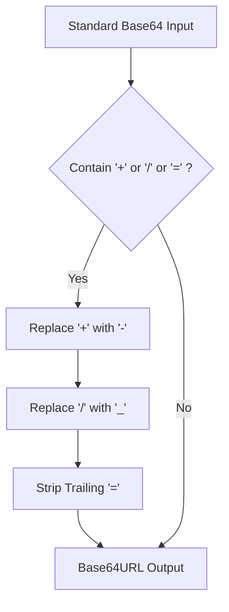

## 1. Syntax Mechanics: What is Base64 Encoding?

In modern software architectures, data transportation relies on standardized text protocols. Standard protocols—including **JSON REST APIs, GraphQL, XML, HTTP headers, cookies, and SMTP email**—were originally designed to carry clean, printable text. 

However, system architectures frequently require transferring binary data (such as image files, PDF documents, or cryptographic hashes) through these text-only pipelines.

If you attempt to transmit raw binary data through a text-based medium, the system will often misinterpret the binary byte values. For example, bytes matching control codes like `0x00` (Null), `0x0A` (Line Feed), or `0x0D` (Carriage Return) can alter text formatting or prematurely terminate transmissions.

```
[Raw Binary Stream] ──> [Base64 Encoder (RFC 4648)] ──> [Safe 6-Bit ASCII Text] ──> [Safe JSON/SMTP Transport]
```

To resolve this issue, **RFC 4648** defines **Base64**: a standardized **binary-to-text encoding scheme**. It translates raw binary streams into a restricted subset of 64 printable, URL-safe ASCII characters:

*   **Uppercase Letters (Index 0–25):** `A-Z`
*   **Lowercase Letters (Index 26–51):** `a-z`
*   **Numeric Digits (Index 52–61):** `0-9`
*   **Alphabet Boundary Characters (Index 62–63):** `+` (plus) and `/` (forward slash)

The equals sign **`=`** acts as a special padding character to indicate byte alignment. By mapping binary data to this safe 64-character alphabet, you ensure data travels through text-based protocols without corruption.

---

## 2. The Step-by-Step Mathematics of Base64 Bit Shifting

Base64 works by partitioning a continuous stream of binary data into 6-bit blocks. Mathematically, the algorithm processes inputs in **3-byte (24-bit)** chunks, mapping each chunk to **4 characters (6 bits each)** in the Base64 alphabet.

```
Original Input (24 bits): [ 8-bit Byte 1 ] [ 8-bit Byte 2 ] [ 8-bit Byte 3 ]
Split Output (24 bits):   [ 6-bit Block 1 ][ 6-bit Block 2 ][ 6-bit Block 3 ][ 6-bit Block 4 ]
```

### Manual Conversion Example: Encoding the String "WTK"

Let’s manually trace the encoding of the three characters **"WTK"**:

#### Step 1: Convert ASCII Characters to 8-Bit Binary Bytes
First, convert each character to its decimal ASCII index, then to its 8-bit binary representation:
*   `W` = Decimal `87` = Binary `01010111`
*   `T` = Decimal `84` = Binary `01010100`
*   `K` = Decimal `75` = Binary `01001011`

Concatenate these bytes to form a continuous **24-bit stream**:
```
01010111  01010100  01001011
```

#### Step 2: Split into 6-Bit Blocks
Next, divide the 24-bit stream into four 6-bit segments:
*   Block 1: `010101`
*   Block 2: `110101`
*   Block 3: `000100`
*   Block 4: `101011`

#### Step 3: Convert to Decimal Indexes
Convert each 6-bit binary block back to a decimal number:
*   `010101` = Decimal `21`
*   `110101` = Decimal `53`
*   `000100` = Decimal `4`
*   `101011` = Decimal `43`

#### Step 4: Map to the Base64 Alphabet
Finally, map each decimal value to its corresponding character in the Base64 index table:
*   Decimal `21` maps to **`V`**
*   Decimal `53` maps to **`1`**
*   Decimal `4` maps to **`E`**
*   Decimal `43` maps to **`r`**

Thus, the input string **"WTK"** is encoded exactly as **`V1Er`**.

---

## 3. The Mechanics of Base64 Padding (`=` and `==`)

The encoding math is straightforward when your input data is a multiple of 3 bytes. However, when the input stream has 1 or 2 leftover bytes, the parser must apply **padding** to maintain byte boundary alignment.

Because the system works in 24-bit blocks, any trailing bytes must be padded with zero bits to complete the final 6-bit block. The missing input bytes are then represented in the output string using one or two `=` padding characters.

### Scenario A: 1 leftover Byte (8 bits)
If the input ends with a single byte, we need 12 bits (two 6-bit blocks) to represent it. The second block is padded with four zero bits:
1.  Input: `"W"` = `01010111` (8 bits)
2.  Split into 6-bit blocks: `010101` (6 bits) and `11` (2 bits remaining).
3.  Pad the remaining bits with four zeros: `010101` (Decimal 21) and `110000` (Decimal 48).
4.  Map to Base64: `21` = `V`, `48` = `w`.
5.  Since we are missing two bytes to form a perfect 24-bit alignment block, we append **two padding characters (`==`)** to the output.

Output for `"W"`: **`Vw==`**

### Scenario B: 2 leftover Bytes (16 bits)
If the input ends with two bytes, we need 18 bits (three 6-bit blocks) to represent them. The third block is padded with two zero bits:
1.  Input: `"WT"` = `01010111 01010100` (16 bits)
2.  Split into 6-bit blocks: `010101` (6 bits), `110101` (6 bits), and `00` (4 bits remaining).
3.  Pad the remaining bits with two zeros: `010101` (Decimal 21), `110101` (Decimal 53), and `000000` (Decimal 0).
4.  Map to Base64: `21` = `V`, `53` = `1`, `0` = `A`.
5.  Since we are missing one byte to complete the 24-bit block, we append **one padding character (`=`)** to the output.

Output for `"WT"`: **`V1A=`**

---

## 4. Web Performance Budgets: The 33.33% Size Overhead Trap

While Base64 is incredibly useful for safe data transmission, it introduces a significant performance trade-off: **payload size inflation**.

### The Mathematical Proof of Expansion
Because every 3 bytes of raw binary data are converted into 4 characters of ASCII text, Base64 encoding increases file sizes by exactly **$33.33\%$**:

$$\text{Data Expansion} = \frac{4 \text{ Output Characters}}{3 \text{ Input Bytes}} - 1 = 33.33\%$$

This expansion has significant implications for web performance. If you encode a 3MB image, the resulting Base64 string will consume **4MB** of bandwidth.

### Payload Size Inflation Reference Table

The table below shows how Base64 encoding inflates the size of various assets:

| Original Asset Size | Base64 Encoded Size | Network Bandwidth Increase | Recommended Action |
| :--- | :--- | :---: | :--- |
| **1 KB** (Tiny Icon) | `1.33 KB` | +0.33 KB | **Safe to inline in critical CSS** |
| **10 KB** (Small Logo) | `13.33 KB` | +3.33 KB | **Avoid inlining; host as SVG/WebP** |
| **100 KB** (Image) | `133.33 KB` | +33.33 KB | **Banned from inline; load asynchronously** |
| **1 MB** (Attachment) | `1.33 MB` | +330 KB | **Upload to Object Store; reference via URL** |
| **10 MB** (Large PDF) | `13.33 MB` | +3.33 MB | **Always process streamingly in chunks** |

### The CSS Inlining Performance Trap
Developers often inline small icons directly into their CSS files using Base64 Data URIs:

```css
.icon-search {
  background-image: url("data:image/png;base64,iVBORw0KGgoAAAANSUhEUgAAABAA...");
}
```

*   **The Benefit:** You eliminate one HTTP request to fetch the image.
*   **The Problem:** You increase the size of your critical CSS file by 33%. 

Because CSS is a render-blocking resource, a larger CSS file delays **First Contentful Paint (FCP)** and **Largest Contentful Paint (LCP)**. 

Additionally, Base64-inlined images cannot be cached independently by the browser. If you update a single CSS style, the browser must redownload the entire stylesheet—including all inlined images.

---

## 5. Common Base64 Implementation Traps & Mistakes

To build reliable and secure systems, avoid these common Base64 implementation mistakes:

### 1. Using Base64 for Security or Encryption
Base64 is a **reversible encoding scheme**, not an encryption method. Anyone can decode a Base64 string back to its original binary form in milliseconds using native tools:

```bash
# Decoding Base64 in terminal
echo "U2VjdXJl" | base64 --decode # Returns "Secure"
```

Never use Base64 to store passwords, API keys, or sensitive database records. For security, always use secure hashing algorithms (like Argon2 or bcrypt) or robust encryption standards (like AES-256).

### 2. Standard Browser `btoa` Multi-Byte Crashes
The browser's native `window.btoa()` (binary-to-ASCII) and `window.atob()` functions only support 8-bit Latin-1 strings. If your string contains multi-byte Unicode characters (like emojis or non-English alphabets), the browser will throw a `DOMException` error.

To encode multi-byte strings safely, convert the string to UTF-8 bytes first using `TextEncoder` before encoding:

```javascript
// SAFE MULTI-BYTE ENCODING
function safeUnicodeB64Encode(str) {
  const bytes = new TextEncoder().encode(str);
  const binaryString = Array.from(bytes, byte => String.fromCharCode(byte)).join('');
  return window.btoa(binaryString);
}
```

### 3. Serverless Buffer Overflow and Out-of-Memory Errors
Processing large Base64 strings (e.g., 20MB file uploads) in serverless environments (like AWS Lambda) can lead to out-of-memory errors. The serverless function must load the entire Base64 string into RAM to parse and convert it, consuming significant memory. 

To prevent performance issues, always stream large payloads in chunks rather than processing them as single massive strings.

---

## 6. How to Safely Test, Decode, and Debug Base64 Payloads

Testing and validating Base64 payloads is crucial, especially when working with security-sensitive data like JSON Web Tokens or API headers.

```
[Raw Base64 Payload] ──> [Format & Audit Locally] ──> [Verify Integrity Check] ──> [Safe Production Decode]
```

### Step 1: Use an Air-Gapped Local Sandbox
To prevent leaking sensitive tokens or system data, never paste production payloads into online decoders that send your data to remote servers. Instead, use a secure, 100% client-side tool—like our modernized **[Base64 Encoder & Decoder](/tools/base64-encoder/)**—to process all data locally within your browser sandbox.

### Step 2: Validate String Integrity
Before attempting to decode a Base64 string, verify that it is valid. Standard Base64 strings must have a length that is a multiple of 4 characters and contain only characters from the Base64 alphabet.

### Step 3: Check for Hidden Padding Collisions
If your application decodes Base64 strings from various sources, normalize the strings to handle missing padding or URL-safe character variations (`-` and `_` replacing `+` and `/`) before passing them to the decoder.

---

## 7. React & Next.js Client-Side Drag-and-Drop Base64 File Uploader

Below is a production-ready React component written in TypeScript. It implements a secure, client-side file-to-Base64 converter. 

Users can drag and drop any file (like an image or PDF) to convert it to a Base64 string locally in their browser. This approach ensures total data privacy:

```typescript
import React, { useState, useCallback } from 'react'

interface ConversionResult {
  fileName: string
  fileSize: number
  fileType: string
  base64String: string
  dataUri: string
}

export const Base64FileConverter: React.FC = () => {
  const [result, setResult] = useState<ConversionResult | null>(null)
  const [loading, setLoading] = useState(false)
  const [error, setError] = useState<string | null>(null)

  const processFile = (file: File) => {
    setLoading(true)
    setError(null)
    setResult(null)

    const reader = new FileReader()
    reader.onload = (e) => {
      const dataUri = e.target?.result as string
      // Extract the raw Base64 string from the Data URI
      const base64String = dataUri.split(',')[1]

      setResult({
        fileName: file.name,
        fileSize: file.size,
        fileType: file.type,
        base64String,
        dataUri
      })
      setLoading(false)
    }

    reader.onerror = () => {
      setError('Failed to read and process the file.')
      setLoading(false)
    }

    reader.readAsDataURL(file)
  }

  const handleDrop = useCallback((e: React.DragEvent<HTMLDivElement>) => {
    e.preventDefault()
    const file = e.dataTransfer.files?.[0]
    if (file) processFile(file)
  }, [])

  return (
    <div className="converter-card">
      <h3>Secure Client-Side File to Base64 Converter</h3>
      <p className="converter-help">
        Convert images, documents, or binaries to Base64 locally. Your files are processed entirely in your browser.
      </p>

      <div
        className="drag-drop-zone"
        onDragOver={(e) => e.preventDefault()}
        onDrop={handleDrop}
      >
        <p>Drag and drop your file here, or click to upload</p>
        <input
          type="file"
          onChange={(e) => {
            const file = e.target.files?.[0]
            if (file) processFile(file)
          }}
          className="hidden-file-input"
        />
      </div>

      {loading && <p className="loading-text">Converting file payload...</p>}
      {error && <p className="error-text">{error}</p>}

      {result && (
        <div className="conversion-results">
          <h4>Conversion Successful</h4>
          <div className="metadata-grid">
            <p><strong>File Name:</strong> {result.fileName}</p>
            <p><strong>Size:</strong> {(result.fileSize / 1024).toFixed(2)} KB</p>
            <p><strong>Mime Type:</strong> {result.fileType}</p>
          </div>

          <div className="output-wrapper">
            <label>Raw Base64 String</label>
            <textarea
              readOnly
              value={result.base64String}
              rows={5}
              className="output-textarea"
            />
          </div>

          <div className="output-wrapper">
            <label>Data URI Format</label>
            <textarea
              readOnly
              value={result.dataUri}
              rows={5}
              className="output-textarea"
            />
          </div>
        </div>
      )}

      <style>{`
        .converter-card {
          padding: 2rem;
          background: #111827;
          border: 1px solid rgba(255, 255, 255, 0.1);
          border-radius: 12px;
          color: #ffffff;
        }
        .converter-help {
          font-size: 0.875rem;
          color: #9ca3af;
          margin-bottom: 1.5rem;
        }
        .drag-drop-zone {
          border: 2px dashed rgba(255, 255, 255, 0.15);
          border-radius: 8px;
          padding: 3rem 2rem;
          text-align: center;
          background: #1f2937;
          cursor: pointer;
          position: relative;
        }
        .hidden-file-input {
          position: absolute;
          top: 0;
          left: 0;
          width: 100%;
          height: 100%;
          opacity: 0;
          cursor: pointer;
        }
        .loading-text {
          color: #34d399;
          margin-top: 1rem;
        }
        .error-text {
          color: #f87171;
          margin-top: 1rem;
        }
        .conversion-results {
          margin-top: 2rem;
          background: #1f2937;
          padding: 1.5rem;
          border-radius: 8px;
        }
        .metadata-grid {
          display: grid;
          grid-template-columns: repeat(auto-fit, minmax(200px, 1fr));
          gap: 1rem;
          margin-bottom: 1.5rem;
          background: #111827;
          padding: 1rem;
          border-radius: 6px;
        }
        .output-wrapper {
          margin-bottom: 1rem;
        }
        .output-wrapper label {
          font-size: 0.875rem;
          color: #9ca3af;
          display: block;
          margin-bottom: 0.5rem;
        }
        .output-textarea {
          width: 100%;
          background: #111827;
          border: 1px solid rgba(255, 255, 255, 0.1);
          border-radius: 6px;
          color: #34d399;
          font-family: monospace;
          padding: 0.75rem;
          resize: vertical;
        }
      `}</style>
    </div>
  )
}
```

---

## 8. Base64 URL Variants: Deep-Dive into JWTs & URL Routing

Standard Base64 contains the characters `+` and `/`. In standard URL patterns, `/` represents directory hierarchies, and `+` is often used to format spaces in query parameters. Additionally, `=` is a reserved character used to denote query parameters.

If you attempt to pass standard Base64 strings in URL paths, query parameters, or cookies, the web server may corrupt the data or fail to route the request properly.

### The Base64URL Standard (RFC 4648 Section 5)
To solve this, developers use **Base64URL** encoding. This variant modifies standard Base64:
1.  The character **`+`** (Index 62) is replaced with **`-`** (minus).
2.  The character **`/`** (Index 63) is replaced with **`_`** (underscore).
3.  All trailing **`=`** padding characters are omitted to keep the string compact.



### JSON Web Tokens (JWT) Implementation
Every JSON Web Token (JWT) is split into three parts separated by dots (`Header.Payload.Signature`). Each of these three segments is encoded using the **Base64URL** standard to ensure they can be safely transmitted inside HTTP headers and query strings:

```
eyJhbGciOiJIUzI1NiIsInR5cCI6IkpXVCJ9.
eyJzdWIiOiIxMjM0NTY3ODkwIiwibmFtZSI6IkFidSBTdWZ5YW4iLCJpYXQiOjE1MTYyMzkwMjJ9.
SflKxwRJSMeKKF2QT4fwpMeJf36POk6yJV_adQssw5c
```

---

## 9. Wikidata sameAs Linkings for Ultimate Semantic Authority

In modern Search Engine Optimization (SEO) and Generative Search Engine Optimization (GEO), establishing topical authority relies on linking content to global entity databases. Connecting technical terms to structured knowledge resources—like **Wikidata** or **Wikipedia**—helps search engine NLP models resolve ambiguous terms and verify the accuracy of technical information.

When documenting binary encoding or writing about Base64 systems, linking directly to the verified global Wikidata entity resolves semantic ambiguity:

```json
{
  "@context": "https://schema.org",
  "@type": "TechArticle",
  "headline": "Base64 Encoding & Decoding: The Ultimate Developer's Guide",
  "about": {
    "@type": "Thing",
    "name": "Base64",
    "sameAs": "https://www.wikidata.org/wiki/Q11082" // Direct connection to global Wikidata entity
  }
}
```

By linking to verified knowledge bases, search engines can immediately associate your organization, products, or authors with high-authority semantic entities. This semantic connection strengthens topical authority, enhancing eligibility for Google Knowledge Graph panels and GEO AI-generated answers.

---

## 10. Securely Convert Binary Payloads with WebToolkit Pro

Converting files and strings to Base64 manually is tedious and prone to encoding errors. For fast, secure, and private conversions:

Use our highly advanced **[Base64 Encoder & Decoder Tool](/tools/base64-encoder/)**.

Built entirely on zero-server client-side principles, our modernized suite runs within a secure local browser sandbox:
*   **UTF-8 Safe Engine:** Handles all complex multi-byte characters and modern emojis without throw/catch crashes.
*   **Base64URL Option:** Switch between standard formatting and URL-safe parameter modes in one click.
*   **Client-Side Binary Upload:** Drag-and-drop raw files directly into your browser window for instant local conversion and file downloads, ensuring complete data privacy.

---

### About The Author

**Abu Sufyan** is an enterprise systems engineer, web performance architect, and developer tooling designer based in Austin, TX. He specializes in V8 execution benchmarking, React hook design, and semantic SEO architectures. You can review his open-source work on [Github](https://github.com/abusufyan-netizen) or check his personal portfolio website at [abusufyan.xyz](https://abusufyan.xyz).
