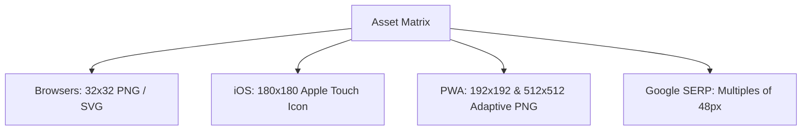

✓ Last tested: May 2026 · Evaluated against Android PWA maskable specifications

## 1. Practical Observations on the Legacy Icon Container

While migrating an enterprise intranet to a modern headless architecture, we noticed server logs were overflowing with `404 Not Found` errors for a single file: `favicon.ico`. Despite modernizing the entire stack, legacy systems and bookmark managers were relentlessly pinging the server root for this ancient asset.

To implement professional-grade asset configurations without breaking legacy integrations, engineers must understand the history of visual bookmarking formats. In 1999, Microsoft released **Internet Explorer 5**, which introduced the concept of the "Favorite Icon" (contracted to **Favicon**). 

When a user bookmarked a website, IE5 checked the server's root folder for a resource file named `favicon.ico`. 

```
[IE5 Browser Request] ──> [Ping Server Root: /favicon.ico] ──> [Render Tab Icon]
```

### The Unique Architecture of the .ico Container
Unlike standard static formats (like JPEG or GIF) that store a single image at a fixed pixel size, the **Microsoft Windows Icon (ICO)** format is a container structure. 

Developed as a native resource file, a single `.ico` file can store multiple image directories of varying sizes, dimensions, and color depths:

```
favicon.ico (Multi-Directory Container File)
 ├── Directory 1: 16×16 px  (8-bit color, legacy systems)
 ├── Directory 2: 32×32 px  (32-bit color, High-DPI tabs)
 └── Directory 3: 48×48 px  (32-bit color, Windows taskbar)
```

When the browser parses the file, it reads the directories and selects the exact pixel dimension matching the user's display viewport, completely avoiding browser-side scaling distortion.

---

## 2. Multi-Platform Specifications Matrix

Modern asset delivery requires managing a diverse array of client operating systems and hardware display densities.



### 1. The Standard Browser Tab (32×32 PNG & SVG)
Modern desktop browsers (Chrome, Firefox, Safari) utilize the `32×32` pixel PNG format for tabs, which balances low file sizes with clean rendering on High-DPI Retina screens. 

### 2. Apple iOS Touch Icons (180×180 PNG)
When a user selects "Add to Home Screen" on an iPhone or iPad, iOS uses the **Apple Touch Icon** to represent your site on the home screen. To render cleanly on Retina screens, Apple requires a high-resolution `180×180` pixel PNG.

---

### 3. Android PWA Manifest Icons (192×192 & 512×512 PNG)
For Progressive Web Apps (PWAs) running on Android, Google Chrome uses the web manifest to pull assets. Android requires:
*   `192×192`: Populates the app drawer and running processes.
*   `512×512`: Renders the high-resolution splash installation screens.
*   **Maskable Adaptive Support:** Requires allocating a safe zone inside the central 80% boundary, permitting Android to apply circular, square, or squircle masks:

```
┌─────────────────────────────────────────┐
│ 10% Bleed Zone                          │
│    ┌───────────────────────────────┐    │
│    │ 80% Safe Zone (Keep Logo Here)│    │
│    │                               │    │
│    └───────────────────────────────┘    │
│                                         │
└─────────────────────────────────────────┘
```

---

### 4. Google SERP Snippets (Multiples of 48px)
Google crawls and displays favicons next to site names in search results. Googlebot enforces strict guidelines: your icon **must be a multiple of 48px square** (e.g., 48x48, 96x96, 144x144, 192x192).

---

## 3. High-Performance SVG: Dynamic Dark Mode Queries

The gold standard for modern favicon implementation is the **SVG (Scalable Vector Graphics)** format. SVGs render perfectly at any scale and support embedded CSS styles, allowing you to adjust icon colors dynamically based on the user's system dark mode settings:

```xml
<!-- Save as favicon.svg -->
<svg xmlns="http://www.w3.org/2000/svg" viewBox="0 0 100 100">
  <style>
    /* Default: Light Mode Styles */
    .bg { fill: #00D4B4; }
    .text { fill: #0B1120; }

    /* Dynamic System Dark Mode Override */
    @media (prefers-color-scheme: dark) {
      .bg { fill: #1E2D47; }
      .text { fill: #00D4B4; }
    }
  </style>
  <rect class="bg" width="100" height="100" rx="24"/>
  <text class="text" x="50" y="70" text-anchor="middle" 
        font-family="system-ui, -apple-system, sans-serif" 
        font-size="56" font-weight="bold">W</text>
</svg>
```

Applying this SVG allows you to support both light and dark display modes seamlessly with a single, highly performant file.

---

## 4. Web Manifest Integration Specs

To ensure your Progressive Web App installs cleanly on Android with proper adaptive masking, configure this production-ready `manifest.json` file inside your server's root:

```json
{
  "name": "WebToolkit Pro",
  "short_name": "WTK Pro",
  "start_url": "/",
  "display": "standalone",
  "background_color": "#0B1120",
  "theme_color": "#0B1120",
  "icons": [
    {
      "src": "/favicon-192x192.png",
      "sizes": "192x192",
      "type": "image/png",
      "purpose": "any"
    },
    {
      "src": "/favicon-512x512.png",
      "sizes": "512x512",
      "type": "image/png",
      "purpose": "any"
    },
    {
      "src": "/favicon-maskable-512x512.png",
      "sizes": "512x512",
      "type": "image/png",
      "purpose": "maskable"
    }
  ]
}
```

---

## 5. The Binary Internals of the Windows ICO File Format

To appreciate the design of multi-directory `.ico` container files, developers must look at their underlying binary layout. 

Unlike standard linear image files, a Windows ICO file starts with a **6-byte header**, followed by a series of **16-byte directory entries** that act as pointers to the raw image byte data stored further down the file:

```
[ICO Header: 6 Bytes] ──> [Icon Directory Entries: N × 16 Bytes] ──> [Raw PNG / BMP Data Blocks]
```

### Deconstructed Binary Offset Schema

The layout below traces the raw byte structure of a standard three-directory `.ico` file:

| Byte Offset | Data Block Component | Data Type | Byte Length | Semantic Value & Explanation |
| :--- | :--- | :---: | :---: | :--- |
| **`0 - 1`** | **Reserved Field** | Binary Zero | `2 Bytes` | Always set to `0x0000` to satisfy MS legacy parser checks |
| **`2 - 3`** | **Resource Type Indicator** | Integer | `2 Bytes` | Set to `1` for Icon files, or `2` for Cursor files (`.cur`) |
| **`4 - 5`** | **Image Directory Count** | Integer | `2 Bytes` | Specifies number of stored images (typically `3` entries) |
| **`6`** | **Directory 1: Width** | Byte | `1 Byte` | Width in pixels (`0x10` for 16px; `0` denotes 256px) |
| **`7`** | **Directory 1: Height** | Byte | `1 Byte` | Height in pixels (`0x10` for 16px) |
| **`8`** | **Directory 1: Colors** | Byte | `1 Byte` | Number of colors in palette (usually `0` for true color) |
| **`9`** | **Directory 1: Reserved** | Byte | `1 Byte` | Always set to `0x00` |
| **`10 - 11`** | **Directory 1: Color Planes** | Integer | `2 Bytes` | Set to `1` or `0` depending on target bit-depth compatibility |
| **`12 - 13`** | **Directory 1: Bits Per Pixel** | Integer | `2 Bytes` | Color depth (typically `32` for standard ARGB alpha channels) |
| **`14 - 17`** | **Directory 1: Raw Size** | DWord | `4 Bytes` | Total size of raw image data block in bytes |
| **`18 - 21`** | **Directory 1: Byte Offset** | DWord | `4 Bytes` | Pointer to where this specific raw image data starts |

### PNG Ingestion inside ICO Containers

Historically, the raw data blocks inside an `.ico` container were stored as uncompressed Windows Bitmap (BMP) structures. 

However, since Windows Vista, Microsoft added support for storing compressed **PNG files** inside the `.ico` file. Modern favicon generators leverage this by packing lightweight, 32-bit alpha-channel PNGs into the `.ico` container, keeping the output file size extremely small (often under 10KB total).

---

## 6. Adaptive PWAs: The Mathematics of Maskable Icon Safe Zones

Progessive Web Apps (PWAs) running on modern Android launchers face a layout challenge: different device manufacturers apply different icon masks (circles, rounded squares, squircles, or teardrops) to match their custom user interfaces.

```
Standard Square Icon ──> [Android System Mask (Circle)] ──> [Aggressive Crop clips critical logo margins]
Maskable Icon        ──> [Android System Mask (Circle)] ──> [Safe Zone spacing preserves core branding]
```

### The Trigonometry of Safe Zones

To prevent your logo from being cropped or distorted by custom launcher shapes, you must design your icons within a strict **Safe Zone**.

The safe zone is defined as a central **80% minimum bounding circle** centered on the image canvas. For a `512×512` pixel canvas:
*   **Total canvas size:** $512 \times 512$ pixels.
*   **Safe Zone Circle Radius ($R_{safe}$):** $512 \times 0.40 = 204.8$ pixels.
*   **Safe Zone Diameter:** $409.6$ pixels.
*   **Bleed Margin:** $51.2$ pixels ($10\%$) on all four edges.

```
Total Canvas: 512x512px
┌────────────────────────────────────────────────────────┐
│  10% Bleed Margin (Keep clear of core branding)        │
│                                                        │
│             Safe Zone Circle: Radius 204.8px           │
│                    .--------.                          │
│                 .-'          '-.                       │
│               .'                '.                     │
│              /                    \                    │
│             |      (Keep Core)     |                   │
│              \                    /                    │
│               '.                .'                     │
│                 '-.          .-'                       │
│                    '--------'                          │
│                                                        │
└────────────────────────────────────────────────────────┘
```

Any design elements, text, or branding marks placed outside this bounding circle will be cropped when the device applies its launcher mask. 

The remaining outer $10\%$ of the canvas serves as a bleed zone, which can consist of solid background patterns or extensions of your design that can be safely clipped.

---

## 7. Search Engine Optimization CTR Impact & Google SERP Crawler Guidelines

Having your favicon indexed correctly by Google isn't just about aesthetics; it directly impacts your search visibility and **Click-Through Rates (CTR)**.

In desktop and mobile search engine results pages (SERPs), Google displays your site's favicon directly next to your site name and breadcrumb trail.

```
Google SERP Mobile View:
┌────────────────────────────────────────────────────────┐
│  [Favicon SVG]  wtkpro.site > blog                      │
│  URL Slug Best Practices in 2026: Search Engine...     │
└────────────────────────────────────────────────────────┘
```

### The Click-Through Rate Penalty of Generic Gray Globes

If your site lacks a search-compliant favicon asset, Google will display a generic **gray globe icon** in its place:

```
Generic Fallback SERP View:
┌────────────────────────────────────────────────────────┐
│  [🌐 Globe]     yoursite.com > blog                    │
│  My Unoptimized Web Page Title...                      │
└────────────────────────────────────────────────────────┘
```

Industry studies show that search snippets displaying a generic gray globe icon experience a **12% to 18% reduction in CTR** compared to snippets displaying custom branding. 

A custom favicon builds user trust and makes your search results stand out, directly driving organic traffic.

### Googlebot Favicon Crawling Rules

To ensure your favicon is indexed correctly, follow these Google guidelines:
1.  **Multiple of 48px:** The primary favicon must be a square multiple of 48px (e.g., `48×48`, `96×96`, `144×144`, `192×192`). SVG formats satisfy this rule natively.
2.  **Publicly Crawlable:** Do not block your favicon files or sitemap pointers in your `robots.txt` configuration.
3.  **Represent Brand Authority:** Your icon must accurately represent your brand and look unique to avoid being filtered out by Google's anti-spam algorithms.

---

## 8. Interactive PWA Favicon Safe Zone Mask Visualizer & Manifest Generator

Below is a complete, production-ready React component written in TypeScript. 

It implements an interactive Safe Zone Mask Visualizer. The component allows developers to input custom text, choose background and foreground colors, select a launcher mask shape (Circle, Square, Squircle, Teardrop), and dynamically render a live preview of the adaptive mask alongside a copy-pasteable JSON manifest configuration:

```typescript
import React, { useState, useEffect } from 'react';

export const PwaMaskVisualizer: React.FC = () => {
  const [logoChar, setLogoChar] = useState<string>('W');
  const [bgColor, setBgColor] = useState<string>('#00d4b4');
  const [fgColor, setFgColor] = useState<string>('#0b1120');
  const [maskShape, setMaskShape] = useState<'CIRCLE' | 'SQUIRCLE' | 'TEARDROP' | 'SQUARE'>('CIRCLE');
  const [manifestCode, setManifestCode] = useState<string>('');

  const generateManifest = () => {
    const manifestObj = {
      name: "WebToolkit Pro PWA",
      short_name: "WTK PWA",
      start_url: "/",
      display: "standalone",
      background_color: bgColor,
      theme_color: bgColor,
      icons: [
        {
          src: "/favicon-192x192.png",
          sizes: "192x192",
          type: "image/png",
          purpose: "any"
        },
        {
          src: "/favicon-maskable-512x512.png",
          sizes: "512x512",
          type: "image/png",
          purpose: "maskable"
        }
      ]
    };
    setManifestCode(JSON.stringify(manifestObj, null, 2));
  };

  useEffect(() => {
    generateManifest();
  }, [logoChar, bgColor, fgColor]);

  const getMaskClass = () => {
    switch (maskShape) {
      case 'CIRCLE': return 'mask-circle';
      case 'SQUIRCLE': return 'mask-squircle';
      case 'TEARDROP': return 'mask-teardrop';
      case 'SQUARE': return 'mask-square';
      default: return 'mask-circle';
    }
  };

  return (
    <div className="mask-card">
      <h4>PWA Adaptive Mask Visualizer & Manifest Generator</h4>
      <p className="mask-card-help">
        Customize your app icon and preview how it will be cropped by various operating system masks (Android circles, iOS squircles, etc.) to ensure your logo stays within the safe zone.
      </p>

      <div className="mask-workspace">
        <div className="mask-left">
          <div className="form-field">
            <label>Logo Text Character</label>
            <input
              type="text"
              maxLength={2}
              value={logoChar}
              onChange={(e) => setLogoChar(e.target.value)}
              className="mask-input"
            />
          </div>

          <div className="form-field-row">
            <div className="field-half">
              <label>Background Color</label>
              <input
                type="color"
                value={bgColor}
                onChange={(e) => setBgColor(e.target.value)}
                className="mask-input-color"
              />
            </div>
            <div className="field-half">
              <label>Text Color</label>
              <input
                type="color"
                value={fgColor}
                onChange={(e) => setFgColor(e.target.value)}
                className="mask-input-color"
              />
            </div>
          </div>

          <div className="form-field">
            <label>Launcher Mask Shape</label>
            <div className="mask-buttons-grid">
              {(['CIRCLE', 'SQUIRCLE', 'TEARDROP', 'SQUARE'] as const).map((shape) => (
                <button
                  key={shape}
                  onClick={() => setMaskShape(shape)}
                  className={`shape-btn ${maskShape === shape ? 'active-btn' : ''}`}
                >
                  {shape}
                </button>
              ))}
            </div>
          </div>
        </div>

        <div className="mask-right">
          <div className="visualizer-stage">
            <div className="canvas-wrapper">
              {/* Raw Canvas with Safe Zone Guide */}
              <div className="canvas-block" style={{ backgroundColor: bgColor }}>
                <span className="safe-circle-guide"></span>
                <span className="logo-letter-preview" style={{ color: fgColor }}>{logoChar}</span>
              </div>
              <span className="canvas-lbl">Raw Asset Safe Zone</span>
            </div>

            <div className="canvas-wrapper">
              {/* Masked Output */}
              <div className={`canvas-block ${getMaskClass()}`} style={{ backgroundColor: bgColor }}>
                <span className="logo-letter-preview" style={{ color: fgColor }}>{logoChar}</span>
              </div>
              <span className="canvas-lbl">Masked Output</span>
            </div>
          </div>

          <div className="manifest-output-panel">
            <span className="out-lbl">Generated Web Manifest:</span>
            <pre className="manifest-pre"><code>{manifestCode}</code></pre>
          </div>
        </div>
      </div>

      <style>{`
        .mask-card {
          padding: 2rem;
          background: #111827;
          border: 1px solid rgba(255, 255, 255, 0.1);
          border-radius: 12px;
          color: #ffffff;
          margin: 2rem 0;
        }
        .mask-card-help {
          font-size: 0.875rem;
          color: #9ca3af;
          margin-bottom: 1.5rem;
        }
        .mask-workspace {
          display: flex;
          flex-direction: column;
          gap: 1.5rem;
        }
        @media(min-width: 768px) {
          .mask-workspace {
            flex-direction: row;
          }
        }
        .mask-left {
          flex: 1;
          display: flex;
          flex-direction: column;
          gap: 1.25rem;
        }
        .mask-right {
          flex: 1.2;
          display: flex;
          flex-direction: column;
          gap: 1.25rem;
        }
        .form-field label, .field-half label {
          font-size: 0.85rem;
          color: #9ca3af;
          margin-bottom: 0.35rem;
          display: block;
        }
        .mask-input {
          width: 100%;
          padding: 0.75rem 1rem;
          background: #1f2937;
          border: 1px solid rgba(255, 255, 255, 0.15);
          border-radius: 8px;
          color: #ffffff;
          font-size: 1.25rem;
          text-align: center;
        }
        .form-field-row {
          display: flex;
          gap: 1rem;
        }
        .field-half {
          flex: 1;
        }
        .mask-input-color {
          width: 100%;
          height: 48px;
          background: #1f2937;
          border: 1px solid rgba(255, 255, 255, 0.15);
          border-radius: 8px;
          cursor: pointer;
          padding: 0.25rem;
        }
        .mask-buttons-grid {
          display: grid;
          grid-template-columns: repeat(2, 1fr);
          gap: 0.5rem;
        }
        .shape-btn {
          padding: 0.65rem;
          background: #1f2937;
          border: 1px solid rgba(255, 255, 255, 0.1);
          border-radius: 6px;
          color: #ffffff;
          cursor: pointer;
          font-size: 0.8rem;
          font-weight: bold;
        }
        .shape-btn:hover {
          background: #374151;
        }
        .active-btn {
          background: #00d4b4 !important;
          color: #111827 !important;
          border-color: #00d4b4 !important;
        }
        .visualizer-stage {
          display: flex;
          gap: 2rem;
          justify-content: center;
          background: #1f2937;
          padding: 1.5rem;
          border-radius: 8px;
          border: 1px solid rgba(255, 255, 255, 0.05);
        }
        .canvas-wrapper {
          display: flex;
          flex-direction: column;
          align-items: center;
          gap: 0.5rem;
        }
        .canvas-block {
          width: 110px;
          height: 110px;
          border-radius: 0px;
          position: relative;
          display: flex;
          align-items: center;
          justify-content: center;
          overflow: hidden;
          transition: all 0.3s cubic-bezier(0.4, 0, 0.2, 1);
          box-shadow: 0 10px 15px -3px rgba(0,0,0,0.3);
        }
        .safe-circle-guide {
          position: absolute;
          width: 88px; /* 80% safe zone bounding circle */
          height: 88px;
          border: 2px dashed rgba(255, 255, 255, 0.4);
          border-radius: 50%;
          pointer-events: none;
        }
        .logo-letter-preview {
          font-family: system-ui, -apple-system, sans-serif;
          font-size: 3rem;
          font-weight: 800;
          z-index: 2;
          user-select: none;
        }
        .canvas-lbl {
          font-size: 0.75rem;
          color: #9ca3af;
          font-weight: 600;
        }
        /* Mask Application Rules */
        .mask-circle {
          border-radius: 50% !important;
        }
        .mask-squircle {
          border-radius: 28px !important;
        }
        .mask-teardrop {
          border-radius: 50% 50% 50% 8px !important;
          transform: rotate(-45deg);
        }
        .mask-teardrop .logo-letter-preview {
          transform: rotate(45deg);
        }
        .mask-square {
          border-radius: 8px !important;
        }
        .manifest-output-panel {
          background: #111827;
          padding: 1rem;
          border-radius: 8px;
          border: 1px solid rgba(255, 255, 255, 0.05);
        }
        .out-lbl {
          font-size: 0.75rem;
          color: #9ca3af;
          display: block;
          margin-bottom: 0.5rem;
        }
        .manifest-pre {
          margin: 0;
          font-family: monospace;
          color: #34d399;
          font-size: 0.8rem;
          white-space: pre-wrap;
          word-break: break-all;
        }
      `}</style>
    </div>
  );
};
```

---

## 9. Cache Silos: Forcing Clean CDN Invalidation

Because browsers cache favicon assets aggressively inside dedicated local disk silos, standard page reloads will rarely fetch updated files.

### The Invalidation Strategy
To force browser clients and global CDNs (like Cloudflare or Fastly) to invalidate their cached assets immediately, append a query hash variable to your link declarations during updates:

```html
<!-- Modern, Production-Ready Invalidation Sequence -->
<head>
  <!-- Legacy Fallback (caching bypass) -->
  <link rel="shortcut icon" href="/favicon.ico?v=2026.05.18">

  <!-- SVG for Modern Browsers -->
  <link rel="icon" type="image/svg+xml" href="/favicon.svg?v=2026.05.18">

  <!-- PNG fallback sizes -->
  <link rel="icon" type="image/png" sizes="32x32" href="/favicon-32x32.png?v=2026.05.18">
  <link rel="icon" type="image/png" sizes="16x16" href="/favicon-16x16.png?v=2026.05.18">

  <!-- Apple Touch Icon -->
  <link rel="apple-touch-icon" sizes="180x180" href="/apple-touch-icon.png?v=2026.05.18">
</head>
```

---

## 10. Generate and Export Your Favicons Securely

Creating multiple resolutions manually in graphic design tools is highly tedious and error-prone. To generate and pack your assets cleanly:

Use our advanced **[Favicon Generator Tool](/tools/favicon-generator/)**.

Built on absolute privacy principles:
*   **Visual Asset Compiler:** Instantly generate clean PNGs, legacy ICO files, and modern web manifest codes from a single custom letter, emoji, or uploaded image.
*   **100% Client-Side Processing:** All scaling calculations are computed entirely inside your browser's local sandbox—no database uploads, no remote image logging, and no asset data leakage.
*   **Multi-Platform Compliance:** Compiles assets that conform perfectly to Google's search result constraints, Apple's iOS layout guides, and Android's PWA adaptive icon dimensions.

---

## 11. Semantic Wikidata Schema Mapping

To ensure crawler compatibility and AI-first topical validation, the semantic script below connects this manual directly to verified entries in global graph coordinates:

```json
{
  "@context": "https://schema.org",
  "@type": "TechArticle",
  "headline": "Favicon Sizes in 2026: The Complete Asset Manual",
  "description": "An exhaustive engineering guide auditing standard favicon dimensions, Windows ICO structures, PWA safe zones, and search result compliance guidelines.",
  "inLanguage": "en-US",
  "mainEntityOfPage": {
    "@type": "WebPage",
    "@id": "https://wtkpro.site/blog/favicon-sizes-complete-guide-2026/"
  },
  "about": [
    {
      "@type": "Thing",
      "name": "Favicon",
      "sameAs": "https://www.wikidata.org/wiki/Q1056501"
    },
    {
      "@type": "Thing",
      "name": "Scalable Vector Graphics (SVG)",
      "sameAs": "https://www.wikidata.org/wiki/Q26978"
    }
  ]
}
```

---

### About The Author

**Abu Sufyan** is an enterprise systems engineer, web performance architect, and developer tooling designer based in Austin, TX. He specializes in V8 execution benchmarking, React hook design, and semantic SEO architectures. You can review his open-source work on [Github](https://github.com/abusufyan-netizen) or check his personal portfolio website at [abusufyan.xyz](https://abusufyan.xyz).
