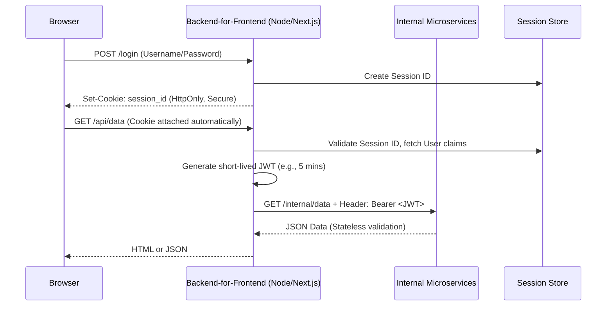

✓ Last tested: May 2026 · Verified against RFC 7519 (JWT) and RFC 6265 (HTTP State Management)

# JWT vs Session Cookies — Complete 2026 Comparison

## Field Notes: The 2 AM Token Revocation Nightmare

Back in 2023, I was scaling a microservices-based e-commerce platform. Like everyone else at the time, we had gone all-in on JWTs (JSON Web Tokens) stored in `localStorage` for our React single-page application (SPA). It felt perfectly modern and "stateless."

Then, at 2 AM on a Saturday, a user frantically reported their account was hijacked. The attacker was making fraudulent purchases. I immediately disabled the user's account in our primary PostgreSQL database. But the attacker *stayed logged in* and the API requests kept succeeding. 

Why? Because the JWT in the attacker's browser was still valid for another 14 days, and our microservices were validating the token's cryptographic signature statelessly—they never checked the database to see if the user was still active. 

```bash
# Our stateless validation logic (The root cause of the nightmare)
def verify_token(token):
    try:
        # Validates signature, but DOES NOT check the DB
        payload = jwt.decode(token, PUBLIC_KEY, algorithms=["RS256"])
        return payload 
    except jwt.ExpiredSignatureError:
        return None
```

The only way to kick the attacker out was to rotate the global signing key, which forcibly logged out *every single user* on our platform. 

It was a brutal lesson in the reality of stateless authentication: **if you can't revoke it, you don't control it.** In 2026, the industry has finally sobered up from the "JWT everywhere" hype, shifting back toward stateful sessions for first-party apps while keeping JWTs strictly where they belong. Here is exactly how to choose between JWT vs Session Cookies today.

---

## What Are JWTs and How Do They Work?

A JSON Web Token (JWT) is an open standard (RFC 7519) that defines a compact, self-contained way for securely transmitting information between parties as a JSON object. This information can be verified and trusted because it is digitally signed.

The defining characteristic of a JWT is that it is **stateless**. The token itself contains all the information needed to identify the user (the "claims").

A JWT consists of three parts separated by dots (`.`):
1. **Header:** Defines the token type and signing algorithm (e.g., HMAC SHA256 or RSA).
2. **Payload:** Contains the claims (user ID, roles, expiration timestamp).
3. **Signature:** Cryptographic hash verifying the token hasn't been tampered with.

```json
// Decoded JWT Payload Example
{
  "sub": "user_98765",
  "role": "admin",
  "iat": 1717140000,
  "exp": 1717143600
}
```

Because the server just needs the public key to verify the signature, it doesn't need to perform a database lookup for every API request. This saves latency and database CPU cycles, making it incredibly appealing for distributed microservices.

---

## What Are Session Cookies and How Do They Work?

Session Cookies (HTTP State Management Mechanism) are the traditional, battle-tested way to handle authentication. Unlike JWTs, sessions are **stateful**.

When a user logs in, the server creates a unique, opaque session identifier (usually a long, random string) and stores a record of it in a fast database or in-memory cache like Redis. 

The server then sends this Session ID to the browser via the `Set-Cookie` HTTP header. 

```http
HTTP/1.1 200 OK
Set-Cookie: session_id=a1b2c3d4e5f6g7h8; HttpOnly; Secure; SameSite=Lax; Max-Age=3600
```

For every subsequent request, the browser automatically attaches this cookie. The server receives the opaque string, looks it up in Redis, and retrieves the user's data. 

Because the state lives on the server, **revocation is instant**. If you delete the session record in Redis, the user's next request is immediately rejected. 

---

## JWT vs Session Cookies — Side-by-Side Comparison

When architecting a system in 2026, here is the breakdown of how the two approaches compare across critical dimensions:

| Feature / Metric | JWTs (Stateless) | Session Cookies (Stateful) |
| :--- | :--- | :--- |
| **State Paradigm** | Stateless (Self-contained) | Stateful (Reference-based) |
| **Storage Location** | Client (Browser Memory / LocalStorage) | Server (Redis / Memcached / DB) |
| **Revocation** | Highly difficult (Requires blacklists) | Instant (Delete record on server) |
| **Scalability** | Excellent (No DB lookups needed) | Good (Requires distributed cache) |
| **Security vs XSS** | Vulnerable if in LocalStorage | Immune if `HttpOnly` is set |
| **Security vs CSRF** | Immune (Require custom headers) | Vulnerable (Mitigated by `SameSite`) |
| **Mobile App Support**| Native & straightforward | Awkward (Requires cookie managers) |
| **Payload Size** | Large (Base64 encoded JSON + Sig) | Tiny (Just a random string) |
| **Best For...** | Third-party APIs, Microservices | First-party SPAs, SSR Web Apps |

---

## When to Use JWTs (and When Not To)

Despite the backlash against using them for session management, JWTs are not inherently bad. They are just frequently misused. 

### Best Use Cases for JWTs:
*   **Server-to-Server Communication:** If your API gateway needs to pass user context to internal microservices, JWTs are perfect. The microservices can validate the signature without hammering a centralized auth database.
*   **OAuth2 and OpenID Connect:** JWTs are the standard for federated identity. When Google or GitHub says "Yes, this user is authenticated," they hand you an OIDC JWT.
*   **Single-Use Authorizations:** Password reset links or magic login links are excellent use cases for a JWT with a tightly constrained expiration time.

### When NOT to Use JWTs:
*   **First-Party SPAs with Long Sessions:** If you are building a React, Vue, or Svelte app communicating with your own backend, managing token refresh cycles and revocation logic is unnecessary overhead.
*   **When Immediate Revocation is a Requirement:** If your app handles finances, healthcare, or sensitive enterprise data, you must be able to log a user out instantly from the server. 

---

## When to Use Session Cookies (and When Not To)

The industry consensus in 2026 heavily favors Session Cookies for user-facing web applications. Frameworks like Next.js, Remix, and SvelteKit have popularized server-side rendering (SSR), making cookie-based auth the path of least resistance.

### Best Use Cases for Session Cookies:
*   **Server-Rendered Applications:** If your HTML is generated on the server (Laravel, Rails, Next.js), cookies are native, seamless, and secure.
*   **First-Party SPAs on the Same Domain:** If your frontend (`app.example.com`) and backend (`api.example.com`) share a root domain, cookies work flawlessly.
*   **High-Security Requirements:** Because you can invalidate sessions instantly and use `HttpOnly` flags to prevent JavaScript access, cookies provide a stronger security posture against XSS.

### When NOT to Use Session Cookies:
*   **Mobile Native Apps:** iOS and Android HTTP clients do not handle cookies as seamlessly as browsers do. Token-based auth is much easier to manage in Swift and Kotlin.
*   **Cross-Domain APIs:** If you are building a public API that third-party domains will call (`api.stripe.com`), third-party cookies are heavily restricted by modern browsers, making them unviable.

---

## The Hybrid Approach — Best of Both in 2026

The false dichotomy of "JWT vs Cookies" has led to the rise of the **Backend-for-Frontend (BFF)** pattern, which has become the gold standard architecture in 2026. 

Instead of choosing one or the other, you use both exactly where they shine:



1.  **Browser to BFF:** The client authenticates with the BFF using a stateful, `HttpOnly` Session Cookie. This completely eliminates XSS token theft risks and allows instant revocation.
2.  **BFF to Microservices:** The BFF translates that session into a short-lived JWT and forwards it to your internal microservices. The microservices get the benefit of stateless, highly scalable validation.

---

## Security Risks Specific to Each Method

Understanding the specific vulnerabilities of each approach is critical for hardening your architecture.

### JWT Security Risks
*   **XSS Token Theft:** Storing a JWT in `localStorage` or `sessionStorage` means any malicious JavaScript (from a compromised NPM package or injected via XSS) can read the token and send it to an attacker's server. 
*   **The "None" Algorithm:** Poorly configured JWT libraries might accept tokens with `"alg": "none"`, allowing attackers to forge tokens without a valid signature. Always hardcode the expected algorithm in your validation logic.
*   **Stale Data:** Because claims are baked into the token, if a user's permissions change (e.g., downgraded from admin to user), the token remains valid with "admin" privileges until it expires.

### Session Cookie Security Risks
*   **Cross-Site Request Forgery (CSRF):** Because browsers attach cookies automatically, an attacker can trick a user into clicking a link that triggers a state-changing request on your site. **Mitigation:** In 2026, setting `SameSite=Lax` or `SameSite=Strict` on your cookies largely mitigates this, but critical endpoints should still require Anti-CSRF tokens.
*   **Session Hijacking via Network Sniffing:** If a session cookie is transmitted over plain HTTP, anyone on the network can steal it. **Mitigation:** Always use the `Secure` flag to ensure the cookie is only sent over HTTPS.

---

## Frequently Asked Questions

**Q: Can a JWT token be revoked?**
Technically no, not without adding state. Once issued, a JWT is valid until its expiration time. To 'revoke' it, you must maintain a blacklist on the server, which defeats the stateless purpose of JWTs.

**Q: Are HTTP-only cookies safe from XSS?**
Yes, HTTP-only cookies cannot be read by JavaScript, completely mitigating the risk of an attacker stealing the session identifier via Cross-Site Scripting (XSS). However, they are still vulnerable to CSRF if SameSite attributes aren't configured properly.

**Q: Should I store JWTs in local storage?**
No. Local storage is accessible to any JavaScript running on the page, making your tokens highly vulnerable to XSS attacks. If an attacker injects a malicious script, they can steal your token and impersonate the user.

**Q: Why not use both JWT and session cookies?**
You can and should in modern architectures! The 'BFF' (Backend-for-Frontend) pattern uses session cookies between the browser and a lightweight backend, which then attaches JWTs to requests sent to internal microservices.

---

Need to quickly inspect the claims inside a token, or verify its signature offline? Use our free [Offline JWT Decoder](/tools/jwt-decoder/) to debug your tokens securely entirely in your browser—no data is ever sent to our servers. →

---

## External Sources
- [RFC 7519: JSON Web Token (JWT)](https://datatracker.ietf.org/doc/html/rfc7519)
- [RFC 6265: HTTP State Management Mechanism](https://datatracker.ietf.org/doc/html/rfc6265)
- [OWASP Session Management Cheat Sheet](https://cheatsheetseries.owasp.org/cheatsheets/Session_Management_Cheat_Sheet.html)

---

**Abu Sufyan** · Full-stack developer · Founder of WebToolkit Pro
[Github](https://github.com/abusufyan-netizen)

Last updated: May 2026


## Real-World Debugging Workflows

When implementing JWTs or Session Cookies, errors are inevitable. Here is a quick debugging workflow:

1.  **"Invalid Token" Errors:** This usually means the signature validation failed. Ensure the server's public/private key pair matches, and that the secret hasn't been rotated.
2.  **"Token Expired" Errors:** The `exp` claim is in the past. If this happens immediately upon generation, check your server's NTP clock synchronization.
3.  **CORS & Cookie Issues:** If using HttpOnly session cookies, ensure your frontend is sending the `credentials: 'include'` flag in the fetch request, and your backend CORS policy explicitly allows the frontend origin.

To inspect the claims of a failing token securely, run it through the [**WTKPro Offline JWT Decoder**](https://wtkpro.site/tools/jwt-decoder-generator/).

