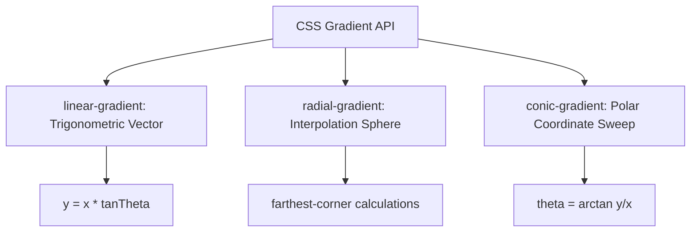

## 1. Geometric Coordinate Mathematics & GPU Pipelines

To design premium web interfaces, developers must master the mathematics and rendering pipelines that browsers execute when styling gradients.



### A. Linear Gradients: The Trigonometric Vector ($y = x \tan(\theta)$)
A `linear-gradient()` transitions colors along a straight line. Under the hood, the browser's rendering engine defines a **Gradient Line** that runs directly through the center of the bounding box.

The angle parameter determines the slope of this line:

$$y = x \tan(\theta)$$

Where:
*   $\theta$ is the angle parameter (e.g., `45deg`, `135deg`).
*   The starting ($0\%$) and ending ($100\%$) coordinates are calculated by projecting perpendicular lines from the corners of the box to meet the gradient line at right angles. This coordinate math guarantees that the transition remains symmetrical regardless of the element's aspect ratio.

---

### B. Radial Gradients: The Interpolation Sphere
A `radial-gradient()` projects colors outwards in a circular or elliptical pattern from a central focal point. The color values are interpolated using a distance calculation from the center ($x_c, y_c$) to the target coordinates ($x, y$):

$$d = \sqrt{(x - x_c)^2 + (y - y_c)^2}$$

The sizing boundaries are defined by four core extent keywords:
*   `closest-side`: The gradient extends to meet the closest edge of the element.
*   `farthest-side`: The gradient extends to meet the furthest edge.
*   `closest-corner`: The shape scales to meet the closest corner of the element.
*   `farthest-corner` (default): The shape scales outwards until its boundary meets the furthest corner, ensuring a smooth, full-cover transition.

---

### C. Conic Gradients: The Polar Coordinate Sweep ($\theta = \arctan(y/x)$)
A `conic-gradient()` sweeps colors around a central pivot point, resembling a color wheel or a radar sweep. Rather than calculating distances from a center point, the rendering engine calculates the **Polar Angle** ($\theta$) of each pixel relative to the origin coordinate ($x_c, y_c$):

$$\theta = \arctan\left(\frac{y - y_c}{x - x_c}\right)$$

This allows designers to build complex, angular color wheels and circular progress sectors without writing a single line of SVG path code.

---

## 2. Real-World UI Architectures Audited

Top-tier engineering and design teams (such as Stripe, Vercel, and Apple) layer these three gradient types to build stunning, modern visual structures.

### Case A: Stripe's Layered Perspective Heros
Stripe's iconic landing pages feature skewed, colorful backgrounds that feel highly immersive. Rather than using large, heavy static images, their templates achieve this effect using layered linear gradients combined with CSS skew transforms:

```css
/* Stripe-Style Layered Perspective Layout */
.stripe-perspective-hero {
  position: relative;
  background-color: #0b0f19;
  overflow: hidden;
}

.stripe-skew-wrapper {
  position: absolute;
  inset: -50% 0;
  transform: skewY(-12deg);
  background: 
    /* Layer 1: Bottom-Left Glow */
    linear-gradient(135deg, rgba(0, 212, 180, 0.15) 0%, transparent 60%),
    /* Layer 2: Top-Right Highlight */
    linear-gradient(225deg, rgba(0, 148, 255, 0.2) 0%, transparent 60%),
    /* Layer 3: Solid Slate Base */
    #0b0f19;
}
```

---

### Case B: Vercel's Interactive Spotlight Cards
Vercel uses glowing, interactive spotlights on their product pages that react to the user's mouse coordinates. You can build this exact effect using a simple mousemove listener mapped to a radial gradient:

```html
<!-- Interactive Spotlight Card Markup -->
<div class="spotlight-card" id="spotlightCard">
  <div class="card-content">
    <h3>Developer Sandbox</h3>
    <p>Stateless offline-first utilities for modern creators.</p>
  </div>
</div>

<style>
.spotlight-card {
  position: relative;
  border-radius: 12px;
  background: #121824;
  padding: 1px; /* Employs thin border spacing */
  overflow: hidden;
}

.spotlight-card::before {
  content: '';
  position: absolute;
  inset: 0;
  background: radial-gradient(
    800px circle at var(--mouse-x, 50%) var(--mouse-y, 50%),
    rgba(255, 255, 255, 0.15),
    transparent 40%
  );
  z-index: 1;
  pointer-events: none;
}

.card-content {
  background: #0b0f19;
  border-radius: 11px;
  padding: 24px;
  position: relative;
  z-index: 2;
}
</style>

<script>
const card = document.getElementById('spotlightCard');
card.addEventListener('mousemove', (e) => {
  const rect = card.getBoundingClientRect();
  const x = e.clientX - rect.left;
  const y = e.clientY - rect.top;
  card.style.setProperty('--mouse-x', `${x}px`);
  card.style.setProperty('--mouse-y', `${y}px`);
});
</script>
```

---

### Case C: Apple's Metallic Conic Reflections
Apple uses conic gradients to simulate realistic metallic reflections on their product display pages, mimicking how light reflects off circular metal surfaces like aluminum or stainless steel:

```css
/* Brushed Metal Volume Dial / Button Reflection */
.metallic-dial {
  width: 120px;
  height: 120px;
  border-radius: 50%;
  background: conic-gradient(
    from 0deg at 50% 50%,
    #e2e8f0 0deg,
    #94a3b8 90deg,
    #e2e8f0 180deg,
    #94a3b8 270deg,
    #e2e8f0 360deg
  );
  box-shadow: 
    inset 0 2px 4px rgba(255,255,255,0.4),
    0 10px 15px -3px rgba(0,0,0,0.3);
}
```

---

## 3. High-Performance GPU Render Pipelines

Layering complex gradients using `background-blend-mode` or creating custom animations can trigger expensive browser paint operations.

When an element updates, the browser's layout engine must recalculate the color interpolation vectors for every single pixel. Under heavy scrolling activity, this can cause noticeable interface lag and drop your page's frame rate.

### Optimization Rules:
1.  **Offload to GPU:** Use hardware-accelerated transforms like `will-change: transform` or `transform: translate3d(0, 0, 0)` on animated gradient containers. This instructs the browser to process the paint operations directly on the device's GPU, preserving CPU resources.
2.  **Avoid Verbose Stops:** Keep your gradient stops concise. Avoid using tools that generate hundreds of individual stop points to simulate easing effects, as this increases stylesheet sizes and slows down the browser's initial rendering passes.

---

## 4. Standard Conic Loading Spinner Blueprint

Conic gradients are the perfect CSS tool for building smooth, lightweight loading spinners without loading large, heavy SVG files or GIF animations:

```html
<!-- High-Performance CSS Spinner -->
<div class="conic-spinner"></div>

<style>
.conic-spinner {
  width: 48px;
  height: 48px;
  border-radius: 50%;
  background: conic-gradient(from 0deg, transparent 0%, #00D4B4 100%);
  mask: radial-gradient(circle at 50% 50%, transparent 60%, black 61%);
  -webkit-mask: radial-gradient(circle at 50% 50%, transparent 60%, black 61%);
  animation: spin 0.8s linear infinite;
  will-change: transform;
}

@keyframes spin {
  100% {
    transform: rotate(360deg);
  }
}
</style>
```

This spinner renders natively at 60fps+, using minimal system resources and keeping your page performance exceptionally high.

---

## 5. Design and Layer Your Gradients Securely

Writing complex gradient rules with multiple stops and coordinate parameters by hand is highly prone to syntax issues. To design and preview your styles safely:

Use our highly advanced **[CSS Gradient Generator Tool](/tools/css-gradient-generator/)**.

Built on absolute privacy principles:
*   **100% Client-Side Sandbox:** All coordinate parameters, stops, and shapes are computed entirely inside your browser's local sandbox—no server uploads, no tracking pixels, and no design data leakage.
*   **Complete Shape Library:** Visually build linear directional vectors, radial extent spotlight scales, and 360-degree conic loops with ease.
*   **Smooth Color-Space Transitions:** Choose HSL and OKLCH color interpolation options to generate smooth, vibrant transitions that completely eliminate muddy gray zones.
