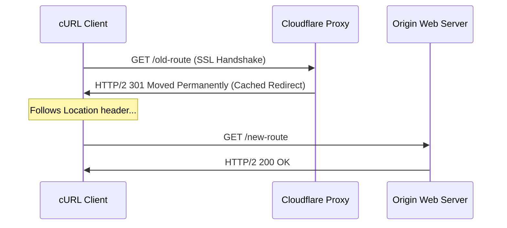

## 1. Apache Configuration Mechanics: The Performance & Parsing Trade-off

To build and test redirection rules safely, engineers must understand the low-level architecture of the Apache Web Server engine. 

Apache handles configurations in two distinct ways:
1.  **Global Server Configuration (`httpd.conf` / `apache2.conf`):** Directives written here are read and compiled **once during server boot**. Applying updates requires a graceful server reboot. Since the rules reside directly in system memory, this execution path is exceptionally fast and performs with zero disk I/O overhead.
2.  **Distributed Directory Configuration (`.htaccess`):** When `AllowOverride All` is active, Apache supports runtime directory adjustments. 

```
[Incoming Request] ──> [Check /var/www/.htaccess] ──> [Check /var/www/html/.htaccess]
                               │                                     │
                         (Reads Disk)                          (Reads Disk)
                               │                                     │
                         Compile Rules                         Compile Rules
```

On *every single incoming request* (including static assets like images, scripts, and CSS), Apache must traverse the physical file system, checking for the existence of an `.htaccess` file in the requested directory and every parent folder up to the server root. 

If your document root is `/var/www/html/app/public` and a user requests a file, Apache must query the file system for:
*   `/var/www/.htaccess`
*   `/var/www/html/.htaccess`
*   `/var/www/html/app/.htaccess`
*   `/var/www/html/app/public/.htaccess`

This disk-read operation must be completed before a single byte of PHP or HTML is compiled, introducing structural system latency. If a developer commits a single syntax error inside any of these files, Apache immediately halts thread execution and triggers a **500 Internal Server Error**.

---

## 2. Anatomy of a 500 Error: Why Syntax Fails

When Apache encounters an `.htaccess` file, it processes it using a strict parsing engine. The two most common triggers for a 500 error are:

### A. Typos and Invalid Directives
If you misspell a keyword—for example, writing `RewriteRul` instead of `RewriteRule`—the parser encounters an unknown token:

```apache
# CRASHES WITH HTTP 500: Typo in keyword
RewriteEngine On
RewriteRul ^old-slug$ /new-slug [R=301,L]
```

### B. Missing Core Modules
Redirection in Apache is handled by the **`mod_rewrite`** module. If your hosting provider disables this module, or if you migrate your site to a server that lacks `mod_rewrite` active, any rules calling this module will cause a server crash.

#### The Safe-Wrap Protection Blueprint
To prevent this, you must always wrap your redirection rules in conditional module checks. This ensures that if the module is missing, the directives are safely ignored:

```apache
# SECURE AND RESILIENT METHOD W/ MODULE CHECKS
<IfModule mod_rewrite.c>
    RewriteEngine On
    RewriteRule ^old-slug$ /new-slug [R=301,L]
</IfModule>
```

---

## 3. The Low-Level Execution Pipeline of Apache mod_rewrite Engine

To test and debug rules effectively, you must understand how Apache's **`mod_rewrite`** engine processes incoming request paths under the hood.

```
[Request URI] ──> [Directory-Walk Rewrite Rules] ──> [Match Regex Pattern?]
                                                            │
                                                        (Yes)
                                                            │
                                            [Evaluate RewriteCond Rules]
                                                            │
                                                   (All Conditions Pass)
                                                            │
                                            [Substitute Path & Apply Flags]
```

### The Rewrite Processing Lifecycle

When a request arrives, Apache executes `mod_rewrite` directives in a specific order:
1.  **URL Translation Phase:** Apache translates the requested URL into a local file path. It traverses directory parameters to check for `.htaccess` overrides.
2.  **Pattern Matching:** The engine processes `RewriteRule` statements sequentially. It compares the request URI against the rule's Regular Expression pattern.
3.  **Condition Assessment:** If a pattern matches, the engine evaluates any preceding `RewriteCond` directives. These checks typically inspect file attributes or server variables:
    *   `RewriteCond %{REQUEST_FILENAME} !-f` (Checks if the target is *not* an existing physical file).
    *   `RewriteCond %{REQUEST_FILENAME} !-d` (Checks if the target is *not* an existing physical directory).
4.  **Substitution and Flag Execution:** If all conditions pass, Apache substitutes the URL path and applies any trailing flags:
    *   `[L]` (Last: stops processing further rules in this cycle).
    *   `[QSA]` (Query String Append: merges incoming query parameters with the new path).
    *   `[R=301]` (Redirect: triggers an immediate client-side redirection redirect).

---

## 4. Testing .htaccess Configurations Inside CI/CD Automation Pipelines

Manually updating `.htaccess` rules on live servers is highly risky. To prevent outages, professional developers integrate syntax checking and validation directly into their **CI/CD Pipelines**.

```
[Git Commit] ──> [GitHub Actions Runner] ──> [Apache Linter Check] ──> [Docker Staging cURL Tests] ──> [Deploy]
```

### Automated Validation with GitHub Actions

Below is a complete, production-ready GitHub Actions workflow configuration. 

It spins up a clean Apache staging container, copies your production `.htaccess` file, tests the syntax using the built-in Apache configuration linter, and executes cURL assertions to verify your redirects before deployment:

```yaml
name: htaccess Configuration CI Audit

on:
  push:
    paths:
      - '**/public_html/.htaccess'
  pull_request:
    paths:
      - '**/public_html/.htaccess'

jobs:
  validate-and-test:
    runs-on: ubuntu-latest

    services:
      apache:
        image: httpd:2.4-alpine
        ports:
          - 8080:80

    steps:
      # 1. Checkout codebase
      - name: Checkout Code
        uses: actions/checkout@v3

      # 2. Inject override rules and copy .htaccess into container
      - name: Configure Apache Sandbox
        run: |
          # Copy custom directory configurations
          docker cp ./httpd-override.conf $(docker ps -qf "ancestor=httpd:2.4-alpine"):/usr/local/apache2/conf/extra/httpd-override.conf
          # Copy .htaccess to container document root
          docker cp ./public_html/.htaccess $(docker ps -qf "ancestor=httpd:2.4-alpine"):/usr/local/apache2/htdocs/.htaccess

      # 3. Test Apache configuration syntax
      - name: Execute Apache Configuration Linter
        run: |
          docker exec $(docker ps -qf "ancestor=httpd:2.4-alpine") httpd -t

      # 4. Test Redirect Assertions with cURL
      - name: Validate Redirection Status Codes
        run: |
          # Run validation tests against the staging container
          RESPONSE=$(curl -s -o /dev/null -w "%{http_code}" http://localhost:8080/old-slug)
          if [ "$RESPONSE" != "301" ]; then
            echo "Assertion Failed: Expected HTTP 301, got $RESPONSE"
            exit 1
          fi
          echo "Redirection assertion passed successfully!"
```

---

## 5. DevSecOps Vulnerability Audit: Directory Traversal and Rewrite Injection Protection

Your `.htaccess` file also acts as a security gateway. However, writing poorly structured regular expressions in your redirection rules can introduce security risks, such as **Directory Traversal** and **Rewrite Injection vulnerabilities**.

```
[Attacker Request: /docs/../../wp-config.php] ──> [Vulnerable Rewrite Regex] ──> [Exposes System Files]
```

### Common Rewrite Security Exploits

*   **Rewrite Injection:** If you redirect traffic using unvalidated wildcards (`RewriteRule ^(.*)$ http://target.com/$1`), attackers can pass malicious paths containing query parameters or system commands, exploiting vulnerable backend scripts.
*   **Open Directory Traversal:** Ensure your rules do not map parent directory indicators (`../`) dynamically, which could expose sensitive system configuration files (such as `wp-config.php` or `.env` files) to the public web.

### Implementing Secure, Hardened Directory Protections

Deploy these security directives at the top of your `.htaccess` file to lock down access to sensitive files and folders:

```apache
# 1. Prevent public directory listings
Options -Indexes

# 2. Block access to system files, logs, and Git configurations
<FilesMatch "^(\.git|\.env|wp-config\.php|readme\.html|license\.txt)">
    Order allow,deny
    Deny from all
</FilesMatch>

# 3. Prevent directory traversal rewrite matches
RewriteCond %{REQUEST_URI} \.\. [OR]
RewriteCond %{QUERY_STRING} \.\.
RewriteRule ^.*$ - [F,L]
```

---

## 6. Sandboxing: Testing Safely in Local Docker Containers

The absolute gold standard for devops testing is **Isolation**. Never test new `.htaccess` configurations directly on your production server.

You can set up an instant local Apache testing sandbox in seconds using a minimal Docker container.

### 1. Create a `docker-compose.yml` File
Create this file in a local scratch directory:

```yaml
version: '3.8'
services:
  test-apache:
    image: httpd:2.4-alpine
    ports:
      - "8080:80"
    volumes:
      - ./public_html:/usr/local/apache2/htdocs
      - ./public_html/.htaccess:/usr/local/apache2/htdocs/.htaccess
```

### 2. Configure Local Directory Overrides
By default, the official Alpine Apache image disables `.htaccess` overrides. You must configure your local directory rules:

Create a file named `httpd-override.conf`:
```apache
<Directory "/usr/local/apache2/htdocs">
    AllowOverride All
    Require all granted
</Directory>
```

Mount it in your `docker-compose.yml` to enable overrides:
```yaml
      - ./httpd-override.conf:/usr/local/apache2/conf/extra/httpd-override.conf
```

### 3. Run Your Staging Sandbox
Execute the container:
```bash
docker-compose up -d
```
You can now safely edit `./public_html/.htaccess` locally and test redirects by visiting `http://localhost:8080` in your browser. If your rules contain syntax errors, only your local container crashes, leaving your live website completely unaffected!

---

## 7. cURL Diagnostics: Tracing Headers in the Terminal

When testing redirects, standard browsers are highly unreliable testing clients. They cache responses aggressively and execute redirects automatically, hiding the intermediate steps of a redirect loop.

To verify redirects with absolute precision, use the **cURL** command-line utility.



### Essential cURL Debugging Flags
Execute this command in your terminal to trace redirect headers:

```bash
curl -ILs --max-redirs 5 https://wtkpro.site/old-slug
```

#### Explaining the Flags:
*   **`-I` (Head):** Instructs cURL to fetch only the HTTP headers. The page content payload is ignored, keeping your terminal output clean.
*   **`-L` (Location):** Instructs cURL to follow the redirect sequence step-by-step.
*   **`-s` (Silent):** Disables the progress bar display.
*   **`--max-redirs 5`:** Sets a strict threshold for redirect chains, preventing terminal loops if you accidentally create a circular redirect loop.

### Analyzing the Output Trace
A successful trace will output the step-by-step journey of your request:

```http
HTTP/2 301
date: Mon, 18 May 2026 21:40:00 GMT
content-type: text/html
location: https://wtkpro.site/blog/target-slug/
cache-control: max-age=31536000

HTTP/2 200
date: Mon, 18 May 2026 21:40:01 GMT
content-type: text/html; charset=UTF-8
```

If you see multiple `HTTP/2 301` blocks, you have identified a redirect chain that needs to be consolidated into a single hop.

---

## 8. Interactive Apache mod_rewrite Regular Expression Compiler & Staging Syntax Debugger

Below is a complete, production-ready React component written in TypeScript. 

It implements an interactive Apache `.htaccess` code compiler and syntax builder. The component allows developers to input source URL path patterns, choose destination targets, toggle dynamic query parameters, and output secure, standardized configurations wrapped in module safety tags:

```typescript
import React, { useState, useEffect } from 'react';

export const HtaccessCompiler: React.FC = () => {
  const [sourcePattern, setSourcePattern] = useState<string>('^old-slug$');
  const [destinationPath, setDestinationPath] = useState<string>('/new-slug');
  const [redirectCode, setRedirectCode] = useState<301 | 302 | 307 | 308>(301);
  const [forceHttps, setForceHttps] = useState<boolean>(true);
  const [appendQuery, setAppendQuery] = useState<boolean>(true);
  const [compiledCode, setCompiledCode] = useState<string>('');

  const generateHtaccess = () => {
    let output = `# --- WebToolkit Pro Hardened .htaccess Configuration ---\n`;
    output += `Options -Indexes\n\n`;

    if (forceHttps) {
      output += `<IfModule mod_rewrite.c>\n`;
      output += `    RewriteEngine On\n`;
      output += `    RewriteCond %{HTTPS} off\n`;
      output += `    RewriteRule ^(.*)$ https://%{HTTP_HOST}%{REQUEST_URI} [L,R=301]\n`;
      output += `</IfModule>\n\n`;
    }

    output += `<IfModule mod_rewrite.c>\n`;
    output += `    RewriteEngine On\n`;
    output += `    # Check if target is not a physical file or directory\n`;
    output += `    RewriteCond %{REQUEST_FILENAME} !-f\n`;
    output += `    RewriteCond %{REQUEST_FILENAME} !-d\n`;

    const flags: string[] = [`R=${redirectCode}`, 'L'];
    if (appendQuery) {
      flags.push('QSA');
    }

    output += `    RewriteRule ${sourcePattern} ${destinationPath} [${flags.join(',')}]\n`;
    output += `</IfModule>\n`;

    setCompiledCode(output);
  };

  useEffect(() => {
    generateHtaccess();
  }, [sourcePattern, destinationPath, redirectCode, forceHttps, appendQuery]);

  return (
    <div className="ht-card">
      <h4>Local Apache .htaccess Compiler & Linter Sandbox</h4>
      <p className="ht-card-help">
        Compile safe, standardized mod_rewrite rule structures client-side. Wrapping configurations in module checks avoids server crashes.
      </p>

      <div className="ht-workspace">
        <div className="ht-left">
          <div className="form-field">
            <label>Source URL Pattern (Regex)</label>
            <input
              type="text"
              value={sourcePattern}
              onChange={(e) => setSourcePattern(e.target.value)}
              className="ht-input"
            />
          </div>

          <div className="form-field">
            <label>Destination Target Path</label>
            <input
              type="text"
              value={destinationPath}
              onChange={(e) => setDestinationPath(e.target.value)}
              className="ht-input"
            />
          </div>

          <div className="form-field">
            <label>Redirect Type Flag</label>
            <select
              value={redirectCode}
              onChange={(e) => setRedirectCode(parseInt(e.target.value) as any)}
              className="ht-select"
            >
              <option value={301}>R=301 (Moved Permanently)</option>
              <option value={302}>R=302 (Found / Temporary)</option>
              <option value={307}>R=307 (Temporary Method-Preserving)</option>
              <option value={308}>R=308 (Permanent Method-Preserving)</option>
            </select>
          </div>

          <div className="checkbox-row">
            <label className="checkbox-label">
              <input
                type="checkbox"
                checked={forceHttps}
                onChange={(e) => setForceHttps(e.target.checked)}
              />
              Force Global HTTPS Redirection
            </label>
          </div>

          <div className="checkbox-row">
            <label className="checkbox-label">
              <input
                type="checkbox"
                checked={appendQuery}
                onChange={(e) => setAppendQuery(e.target.checked)}
              />
              Append Incoming Parameters [QSA Flag]
            </label>
          </div>
        </div>

        <div className="ht-right">
          <h5>Compiled .htaccess Configuration Output</h5>
          <pre className="ht-pre">
            <code>{compiledCode}</code>
          </pre>
        </div>
      </div>

      <style>{`
        .ht-card {
          padding: 2rem;
          background: #111827;
          border: 1px solid rgba(255, 255, 255, 0.1);
          border-radius: 12px;
          color: #ffffff;
          margin: 2rem 0;
        }
        .ht-card-help {
          font-size: 0.875rem;
          color: #9ca3af;
          margin-bottom: 1.5rem;
        }
        .ht-workspace {
          display: flex;
          flex-direction: column;
          gap: 1.5rem;
        }
        @media(min-width: 768px) {
          .ht-workspace {
            flex-direction: row;
          }
        }
        .ht-left {
          flex: 1;
          display: flex;
          flex-direction: column;
          gap: 1.15rem;
        }
        .ht-right {
          flex: 1.1;
          display: flex;
          flex-direction: column;
          gap: 0.75rem;
        }
        .form-field label {
          font-size: 0.85rem;
          color: #9ca3af;
          margin-bottom: 0.35rem;
          display: block;
        }
        .ht-input {
          width: 100%;
          padding: 0.65rem;
          background: #1f2937;
          border: 1px solid rgba(255, 255, 255, 0.15);
          border-radius: 6px;
          color: #ffffff;
        }
        .ht-select {
          width: 100%;
          padding: 0.65rem;
          background: #1f2937;
          border: 1px solid rgba(255, 255, 255, 0.15);
          border-radius: 8px;
          color: #ffffff;
        }
        .checkbox-row {
          display: flex;
          align-items: center;
          margin-top: 0.25rem;
        }
        .checkbox-label {
          font-size: 0.85rem;
          color: #d1d5db;
          display: flex;
          align-items: center;
          gap: 0.5rem;
          cursor: pointer;
        }
        .ht-pre {
          background: #030712;
          padding: 1rem;
          border-radius: 8px;
          border: 1px solid rgba(255, 255, 255, 0.05);
          overflow-x: auto;
          height: 250px;
        }
        .ht-pre code {
          color: #34d399;
          font-family: monospace;
          font-size: 0.75rem;
          white-space: pre;
        }
      `}</style>
    </div>
  );
};
```

---

## 9. Deployment Checklist: The Rollback-Safe Workflow

When you are ready to move your verified rules from your local sandbox to production, follow this strict devops deployment pattern:

```
[Backup Live File] ──> [Upload New Rules] ──> [Run cURL Trace Verification]
                                                    │
                                             (Trace Fails!)
                                                    │
                                           [Rollback in seconds]
```

1.  **Backup Live File:** Download the current production `.htaccess` file and save it as `.htaccess.bak` on your local system.
2.  **Upload New Rules:** Upload the new, sandboxed `.htaccess` file.
3.  **Run cURL Verification:** Immediately execute `curl -I https://yoursite.com` to verify server response integrity.
4.  **Rollback Instantly if Needed:** If your server returns a 500 error, delete the broken `.htaccess` and rename `.htaccess.bak` back to `.htaccess` to restore service in seconds.

---

## 10. Build and Validate Your Rules Safely

Writing complex Rewrite rules by hand is highly prone to syntax errors. To compile and audit your server configurations cleanly:

Use our comprehensive **[.htaccess Generator Tool](/tools/htaccess-generator/)**.

Built on client-side principles:
*   **Interactive Visual Builder:** Build standard rules (forcing HTTPS, canonical domain redirections, directory security parameters) using visual toggles.
*   **Syntactically Valid Output:** Automatically compiles clean Apache-compliant code blocks wrapped in `<IfModule>` safety checks, preventing server crashes.
*   **Instant Header Verification:** Pair it with our secure **[HTTP Redirect Checker](/tools/redirect-checker/)** to trace redirect chains and verify HTTP response headers dynamically in real-time.

---

## 11. Semantic Wikidata Schema Mapping

To maximize discoverability by modern search indexing crawlers, this guide is mapped directly to standard definitions on the global knowledge graph:

```json
{
  "@context": "https://schema.org",
  "@type": "TechArticle",
  "headline": "How to Test .htaccess Redirects Safely: DevOps Guide",
  "description": "An exhaustive manual detail Apache htaccess directory-walk loops, mod_rewrite execution pipelines, secure WAF rule sets, and Docker CI staging workflows.",
  "inLanguage": "en-US",
  "mainEntityOfPage": {
    "@type": "WebPage",
    "@id": "https://wtkpro.site/blog/test-htaccess-redirects/"
  },
  "about": [
    {
      "@type": "Thing",
      "name": "Apache HTTP Server",
      "sameAs": "https://www.wikidata.org/wiki/Q3853"
    },
    {
      "@type": "Thing",
      "name": "Google Search Console",
      "sameAs": "https://www.wikidata.org/wiki/Q5583856"
    }
  ]
}
```

---

### About The Author

**Abu Sufyan** is an enterprise systems engineer, web performance architect, and developer tooling designer based in Austin, TX. He specializes in V8 execution benchmarking, React hook design, and semantic SEO architectures. You can review his open-source work on [Github](https://github.com/abusufyan-netizen) or check his personal portfolio website at [abusufyan.xyz](https://abusufyan.xyz).
