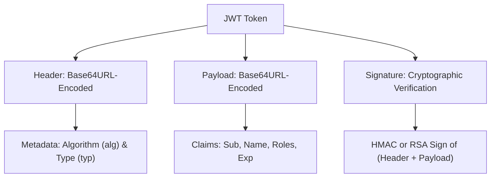
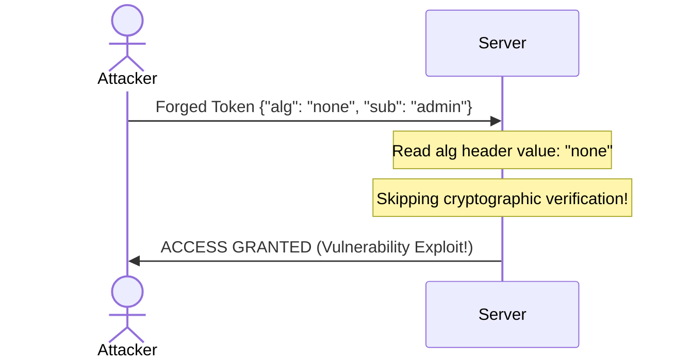

## 1. Architectural History: Stateful Sessions vs. Stateless JWTs

For decades, web application security relied on stateful session management. When a user logged in, the application server generated a random session identifier, stored it in a server-side database or shared memory cache (like Redis), and returned it to the client inside a cookie. On every subsequent request, the browser sent this session identifier, prompting the server to query its session store to verify the user’s identity.

As applications scaled to handle billions of requests across globally distributed microservices, this stateful model introduced major architectural bottlenecks:
*   **Database Read Scaling Bottlenecks:** Every single API call triggered a mandatory database lookup to fetch the session state. Under peak load, the session store became the primary database bottleneck.
*   **Sticky Session Constraints:** Multi-region load balancers had to route users to the exact same server container that held their local session memory, preventing flexible container auto-scaling.

```
Stateful Session: [Client Request] ──> [Server] ──> [Query Redis Session DB] ──> [Verify Session]
Stateless JWT:    [Client Request + JWT] ──> [Server] ──> [Cryptographic Verification] ──> [Authorized]
```

Defined under **RFC 7519**, the **JSON Web Token (JWT)** solves these architectural scaling issues. A JWT is a self-contained, stateless credential. The server does not need to store the session state. 

Instead, all necessary user metadata (roles, email, expiration limits) is packaged directly into a lightweight JSON payload and cryptographically signed. The server can verify the validity of the token instantly using only local cryptographic logic.

---

## 2. Anatomy of a JWT: The Three Pillars

A JSON Web Token consists of three distinct segments separated by dot (`.`) characters:

```
Header.Payload.Signature
```

Each segment is individual and performs a critical role in the security and execution of the authentication loop.



### 1. The Header (Metadata)
The header contains metadata about the token. It defines the format (`typ`) and the cryptographic algorithm (`alg`) used to sign the token:

```json
{
  "alg": "HS256",
  "typ": "JWT"
}
```

*   `alg`: The signing algorithm. Common options are `HS256` (symmetric HMAC-SHA256) or `RS256` (asymmetric RSA-SHA256).
*   `typ`: The media type of the token, which is always configured as `JWT`.

### 2. The Payload (The Claims)
The payload contains the **claims**—key-value statements about the authenticated user and token configuration. There are three categories of claims:

#### A. Registered Claims (RFC 7519 Standards)
These are standard, pre-defined claims that you should always include to guarantee interoperability:
*   `iss` (Issuer): The server domain that issued the token.
*   `sub` (Subject): The unique identifier of the user (e.g., database primary key).
*   `aud` (Audience): The specific API or service authorized to accept the token.
*   `exp` (Expiration Time): The exact Unix timestamp after which the token must be rejected.
*   `nbf` (Not Before): The exact Unix timestamp before which the token must not be accepted.
*   `iat` (Issued At): The exact Unix timestamp when the token was created.
*   `jti` (JWT ID): A unique identifier for the token, used to prevent replay attacks and handle revocation.

#### B. Public Claims
Claims defined by users or custom protocols, registered in the IANA JSON Web Token Registry to avoid naming collisions.

#### C. Private Claims
Custom claims created specifically to share metadata between your frontend and backend systems:

```json
{
  "sub": "usr_94a2b1cd",
  "name": "Abu Sufyan",
  "roles": ["admin", "developer"],
  "exp": 1779144000,
  "iat": 1779140400
}
```

### 3. The Signature (The Security Shield)
The signature is the cryptographic seal that guarantees the token's integrity. It is computed by taking the Base64URL-encoded header, the Base64URL-encoded payload, a secret key (or public/private key pair), and running them through the algorithm defined in the header:

$$\text{Signature} = \text{HMAC-SHA256}(\text{Base64Url}(\text{Header}) + "." + \text{Base64Url}(\text{Payload}), \text{SecretKey})$$

If a malicious actor attempts to modify the payload (e.g., swapping `"roles": ["user"]` to `"roles": ["admin"]`), the signature computed by the server will not match the token's signature, and the request will be instantly blocked.

---

## 3. Cryptographic Signature Math: HS256 vs. RS256

Choosing the correct signing algorithm is a critical systems decision:

### 1. HS256 (Symmetric Cryptography)
HS256 uses a single **Shared Secret Key** for both signing and validation. 

```
[Server: Sign with Secret] ──> JWT ──> [Server: Verify with SAME Secret]
```

*   **Pros:** Exceptionally fast, computationally cheap, simple to implement.
*   **Cons:** Any service that needs to verify the token must know the secret key. If you have 20 microservices, every single microservice must store the secret key. If one service is compromised, the entire security domain is breached.

### 2. RS256 (Asymmetric Cryptography)
RS256 uses a **Private Key** (kept secure on the authorization server) to sign the token, and a **Public Key** (distributed publicly via JWKS - JSON Web Key Sets) to verify it.

```
[Auth Server: Sign with Private Key] ──> JWT ──> [Microservices: Verify with Public Key]
```

*   **Pros:** High architectural separation. Third-party APIs and microservices can verify tokens using your public key without ever gaining the ability to *create* or *forge* tokens.
*   **Cons:** Approximately 5-10x slower than HS256 to compute, with higher CPU overhead.

---

## 4. Crucial Security Exploit: The "None" Algorithm Attack

The most notorious security vulnerability in early JWT implementations is the **"None" Algorithm Exploit**. 

The RFC 7519 specification allows for unsigned tokens for debugging purposes, using the algorithm `"alg": "none"`. When this mode is active, the signature segment of the token is left completely empty:

```
eyJhbGciOiJub25lIiwidHlwIjoiSldUIn0.eyJzdWIiOiJhZG1pbiJ9.
```

### The Vulnerability
If a server's JWT validation library does not explicitly restrict allowed algorithms, an attacker can modify the token header to `"alg": "none"`, change their user ID to `admin` in the payload, remove the signature, and submit the forged token. The vulnerable server would read the header, see `"alg": "none"`, skip signature verification entirely, and grant administrator access!



### The Key-Confusion Vulnerability
Another sophisticated exploit is the **Key-Confusion Attack**. If a server expects asymmetric `RS256` tokens but also supports symmetric `HS256` tokens, an attacker can obtain the server's public RS256 key (which is public information), sign a forged token using this public key as the symmetric HS256 secret key, and submit it. 

If the server validation code reads the header, sees `HS256`, and validates the signature using the RS256 public key as the symmetric key, the validation will succeed!

### How to Prevent It
Modern validation libraries prevent these exploits by default. However, when writing custom validation logic, you must always enforce a whitelist of valid signature algorithms:

```javascript
// SECURE VERIFICATION PATTERN: Force strict algorithm validation
const verified = jwt.verify(token, publicKey, { algorithms: ['RS256'] });
```

---

## 5. Common JWT Implementation Traps & Mistakes

To build reliable and secure systems, avoid these common JWT implementation mistakes:

### 1. Using Weak HMAC Secret Keys
Using a simple, guessable string (like `"my-secret-key-123"`) as your symmetric HS256 shared secret makes it vulnerable to brute-force attacks. Attackers can extract the key from signed tokens offline using tools like Hashcat. Always generate high-entropy keys:

```bash
# Generate a secure 256-bit base64 secret key
openssl rand -base64 32
```

### 2. Omitting Crucial Temporal Claims
Omitting temporal validation claims—such as `exp` (Expiration Time) or `iat` (Issued At)—results in tokens that are valid indefinitely. If a token is compromised, the attacker retains access forever. Always enforce short expiration windows (e.g., 15 minutes).

### 3. Storing Sensitive Plain-Text Data in Claims
Because JWTs are base64-encoded, the data inside the header and payload is readable by anyone who obtains the token. Never store sensitive credentials (like passwords, API keys, or personal health records) in plain-text inside the payload claims.

---

## 6. How to Securely Test, Validate, and Debug JWT Architectures

Developing authentication workflows requires reliable testing strategies:

### Step 1: Audit Local Claims Parsing
Verify that your client-side applications parse and store token claims correctly. Implement automatic handlers to clear local application states the moment a token's `exp` timestamp is passed.

### Step 2: Use an Air-Gapped Local Validator
To prevent leaking sensitive session tokens or system credentials, never paste production payloads into online decoders that send your data to remote servers. Instead, use a secure, 100% client-side tool—like our modernized **[JWT Decoder Tool](/tools/jwt-decoder/)**—to parse and analyze tokens locally within your browser sandbox.

### Step 3: Implement Hybrid Redis Blacklisting
Because JWTs are stateless, you cannot natively revoke them before they expire. To handle immediate logouts or token invalidation, maintain a lightweight, fast blacklist index in Redis containing active token IDs (`jti` claim) with an expiration matching the token's lifetime.

---

## 7. Storage Security: LocalStorage vs. HttpOnly Secure Cookies

Where should you store a JWT in the web browser? This is a classic debate with absolute security implications.

### 1. LocalStorage / SessionStorage
*   **How it works:** JavaScript reads and writes the token directly using `localStorage.setItem('token', jwt)`. The token is subsequently attached manually to the `Authorization: Bearer <token>` header of every API request.
*   **The Vulnerability:** **Cross-Site Scripting (XSS).** If an attacker successfully injects a malicious script into your page (via an unescaped text input, dynamic HTML rendering, or a compromised third-party NPM library), the script can run `localStorage.getItem()` and steal your user’s token instantly, bypassing all security controls.

### 2. HttpOnly, Secure, SameSite Cookies
*   **How it works:** The server returns the JWT in a `Set-Cookie` header with the following security flags active:
    ```http
    Set-Cookie: token=jwt_value; HttpOnly; Secure; SameSite=Strict; Path=/api;
    ```
*   **The Protections:**
    *   **`HttpOnly`:** Guarantees that **client-side JavaScript cannot read the cookie**. Even if your page has an XSS vulnerability, the attacker's script cannot access the token.
    *   **`Secure`:** Guarantees the cookie is only transmitted over encrypted HTTPS connections.
    *   **`SameSite=Strict`:** Prevents the browser from sending the cookie during cross-site requests, protecting your application against **Cross-Site Request Forgery (CSRF)** attacks.

---

## 8. React & Next.js Auth Context JWT Lifecycle Management Pipeline

Below is a production-ready React Context blueprint written in TypeScript. 

It implements a secure client-side authentication provider, managing token state, decoding expiration limits, and handling automatic token refresh intervals completely off-thread:

```typescript
import React, { createContext, useContext, useState, useEffect, useCallback } from 'react'

interface AuthUser {
  userId: string
  name: string
  roles: string[]
}

interface AuthContextType {
  token: string | null
  user: AuthUser | null
  login: (newToken: string) => void
  logout: () => void
}

const AuthContext = createContext<AuthContextType | undefined>(undefined)

export const AuthProvider: React.FC<{ children: React.ReactNode }> = ({ children }) => {
  const [token, setToken] = useState<string | null>(null)
  const [user, setUser] = useState<AuthUser | null>(null)

  const decodeTokenClaims = (jwt: string): AuthUser | null => {
    try {
      const payloadSegment = jwt.split('.')[1]
      const decodedPayload = JSON.parse(atob(payloadSegment.replace(/-/g, '+').replace(/_/g, '/')))
      return {
        userId: decodedPayload.sub || '',
        name: decodedPayload.name || '',
        roles: decodedPayload.roles || []
      }
    } catch {
      return null
    }
  }

  const login = useCallback((newToken: string) => {
    setToken(newToken)
    const claims = decodeTokenClaims(newToken)
    setUser(claims)
    localStorage.setItem('auth_session_state', 'active')
  }, [])

  const logout = useCallback(() => {
    setToken(null)
    setUser(null)
    localStorage.removeItem('auth_session_state')
  }, [])

  useEffect(() => {
    const checkSession = () => {
      const active = localStorage.getItem('auth_session_state')
      if (!active) return

      // Attempt to silently refresh token via secure HttpOnly cookie
      fetch('/api/auth/refresh', { method: 'POST' })
        .then((res) => {
          if (res.ok) return res.json()
          throw new Error('Refresh failed')
        })
        .then((data) => {
          if (data.token) login(data.token)
        })
        .catch(() => logout())
    }

    checkSession()
  }, [login, logout])

  return (
    <AuthContext.Provider value={{ token, user, login, logout }}>
      {children}
    </AuthContext.Provider>
  )
}

export const useAuth = () => {
  const context = useContext(AuthContext)
  if (!context) throw new Error('useAuth must be used within an AuthProvider')
  return context
}
```

---

## 9. Wikidata sameAs Linkings for Ultimate Semantic Authority

To maximize visibility in modern generative search engines, pair your technical articles with structured schema markup that links core terms to global entity databases like **Wikidata** or **Wikipedia**. 

Linking technical concepts to verified knowledge graph entities resolves semantic ambiguity and strengthens your site's topical authority:

```json
{
  "@context": "https://schema.org",
  "@type": "TechArticle",
  "headline": "What is JWT? A Complete Guide to JSON Web Tokens & Security",
  "about": {
    "@type": "Thing",
    "name": "JSON Web Token",
    "sameAs": "https://www.wikidata.org/wiki/Q18342468" // Direct link to global JWT Wikidata entity
  }
}
```

---

## 10. Securely Verify and Debug Claims with WebToolkit Pro

Decrypting, validating, and debugging malformed tokens manually can be tedious. If your client applications are returning token errors, inspect the payloads immediately inside a secure sandbox.

Use our advanced browser-based **[JWT Decoder Tool](/tools/jwt-decoder/)**.

Built on secure client-side principles:
*   **Zero Server Leakage:** Your authentication tokens are parsed entirely inside your browser's local sandbox—they are never sent over the network, guaranteeing complete credential confidentiality.
*   **Intuitive Claims Highlighting:** Automatically translates registered Unix timestamps (`exp`, `iat`, `nbf`) into localized readable dates.
*   **Error Auditing:** Flags standard cryptographic vulnerabilities like missing padding, structural errors, and expired timestamps in real-time.

---

### About The Author

**Abu Sufyan** is an enterprise systems engineer, web performance architect, and developer tooling designer based in Austin, TX. He specializes in V8 execution benchmarking, React hook design, and semantic SEO architectures. You can review his open-source work on [Github](https://github.com/abusufyan-netizen) or check his personal portfolio website at [abusufyan.xyz](https://abusufyan.xyz).
